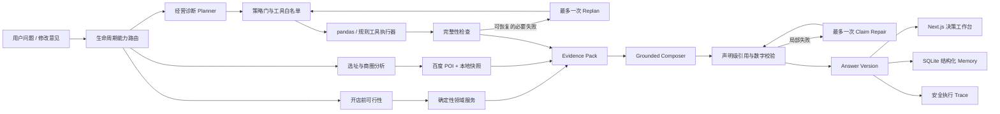

<div align="center">

# Market Pilot

**把餐饮经营问题，变成有数据、有证据、可追溯的决策。**

面向单店餐饮的全生命周期决策 Agent：开店前评估项目与商圈，开店后诊断经营数据，<br>
再通过受约束的 Plan-and-Execute、确定性工具和声明级校验生成可执行建议。


[5 分钟演示](#5-分钟演示) · [Agent 架构](#agent-架构) · [本地运行](#本地运行) · [评测证据](#评测与质量门)

</div>

## 为什么做这个项目

餐饮分析不能只靠模型“聊经验”：营业额、毛利、保本线必须算得准，建议还要说明依据。Market Pilot 将两类工作分开：

- **程序负责事实**：pandas 与领域规则计算指标，所有数据结论回指结构化证据。
- **模型负责决策**：识别意图、选择受限能力、综合结论，并在证据不足时明确边界。
- **系统负责可信**：策略门、类型化工具结果、局部修复、降级、版本链和运行追踪共同约束 Agent。

它不是套在 CSV 外面的聊天框，而是一条可以测试、审计和复现的餐饮决策流水线。

## 两个业务模块

| 阶段 | 用户问题 | 已实现能力 | 结果 |
| --- | --- | --- | --- |
| **开店前** | 这个项目能不能开？铺位是否合适？ | 投资/负债/租金压力、预估收入、加盟风险、百度地图 POI、候选商圈评分、数据可信度与快照复用 | 可行性结论、风险清单、核验动作、铺位/区域推荐 |
| **开店后** | 为什么不赚钱？下一步先改什么？ | CSV 自动映射与清洗、营收趋势、菜品矩阵、评论主题、保本生存线、渠道贡献、时段结构、折扣利润 | 指标看板、证据化诊断、优先级行动清单、报告追问 |

经营数据支持 UTF-8、UTF-8 BOM 和 GB18030 编码；可上传订单、菜品成本、评论三类 CSV，单文件上限 5 MB。

## Agent 架构



### LLM、Tool、Memory、Plan 的边界

| 模块 | 做什么 | 不做什么 |
| --- | --- | --- |
| **LLM** | 意图理解、受限规划、证据综合、通用经营建议 | 猜营业额、执行 SQL、读取任意文件、控制地图底层参数 |
| **Tool** | 计算营业额、毛利、保本线、渠道贡献等可复现指标 | 隐藏失败、输出无来源数值、越过声明输入 |
| **Memory** | 保存公开问答、确认后的项目档案、同口径历史指标、结构化修改偏好 | 保存思维链、把旧对话当事实、用向量相似度替代精确指标查询 |
| **Plan** | 在 full / focused 模式选择白名单工具，必要时有界重规划 | 无限循环、任意代码执行、绕过输入与能力策略 |

## 一次追问如何完成

当前报告会先被编译成带短 ID 的压缩 `EvidencePack`。模型不需要猜 `metrics.menu.items` 一类内部路径：

1. **快路径**：当前证据足够时，典型调用为 1 次 Composer、0 次外部工具。
2. **按需检索**：需要历史、行业上下文或本地竞品时，Planner 只能申请抽象能力，程序负责转换为安全查询。
3. **开放顾问模式**：回答固定区分“基于门店数据”“通用经营建议”“当前缺少的信息”。
4. **声明级校验**：逐条检查引用、数字、排名和比较依据；失败只修复或移除对应结论，不再整份丢弃。
5. **用户强制修订**：每次修改生成新的父子版本，表达偏好和经营约束进入有状态、可撤销的结构化记忆。

## 经营分析工具

| 工具 | 核心指标 |
| --- | --- |
| `revenue` | 总营收、订单量、客单价、日趋势、异常日期 |
| `menu` | 销量、销售额、单位毛利、毛利率、菜品四象限 |
| `reviews` | 评分分布、中差评数量、服务/口味/速度等主题 |
| `survival` | 实际毛利率、固定成本、保本营收、保本订单、月利润投影、现金支撑期 |
| `channels` | 堂食/外卖营收、佣金、包材、贡献利润与贡献率 |
| `time_patterns` | 早餐/午市/晚市等时段贡献、前后半段趋势、异常营业日 |
| `discounts` | 标价金额、实际让利、让利率、折扣前后贡献利润 |

所有工具返回统一的 `status / evidence / duration / error_code` 契约。可选工具失败时保留局部结果；必要工具失败时停止不可靠综合，并给出可操作的修复提示。

## 5 分钟演示

启动项目后访问：

```text
http://localhost:3000/demo
```

推荐演示顺序：

1. 从统一入口选择“准备开店”或“正在经营”。
2. 运行开店前问卷，查看投资压力、加盟风险和选址核验动作。
3. 生成样例经营报告，展示保本线、渠道利润、菜品矩阵和证据面板。
4. 追问“根据现有表现推荐一些菜品”，观察数据结论、通用建议和信息缺口分区。
5. 要求“再结合成都趋势”或“回答简短一点”，展示按需检索、强制修订和版本时间线。

完整讲解词见 [Demo 脚本](docs/demo-script.md)，可上传样本位于 `outputs/operating-demo/`。

## 本地运行

### 方式一：Windows 启动器

已有本地发行包时，双击 `dist/MarketPilotLauncher.exe`，点击“启动并打开”。启动器会检查环境、拉起前后端、等待健康检查通过并打开浏览器。

首次生成启动器：

```powershell
powershell -ExecutionPolicy Bypass -File .\launcher\build-launcher.ps1
```

> 启动器面向 Windows x64，需要 .NET 8 Desktop Runtime；Python、Node.js 和项目依赖仍需本机安装。

### 方式二：开发模式

后端：

```powershell
cd backend
python -m pip install -r requirements.txt
python -m uvicorn app.main:app --reload
```

前端：

```powershell
cd frontend
npm install
npm run dev
```

访问 `http://localhost:3000`，后端健康检查为 `http://127.0.0.1:8000/health`。

### 可选外部能力

复制 `.env.example` 为 `.env`，按需填写：

```dotenv
BAIDU_MAP_AK=
AGENT_LLM_PROVIDER=openai-compatible
AGENT_LLM_BASE_URL=https://api.openai.com/v1
AGENT_LLM_API_KEY=
AGENT_LLM_MODEL=
AGENT_LLM_PLANNER_MODEL=
AGENT_LLM_SYNTHESIZER_MODEL=
AGENT_LLM_FOLLOWUP_MODEL=
```

- LLM 使用 OpenAI-compatible Chat Completions 接口，Planner、Synthesizer、Follow-up 可分别选模型。
- 未配置模型、响应不符合 Schema、引用无效或供应商失败时，系统自动回退到确定性路径。
- 百度地图密钥只在后端使用；本地工作台保存的密钥通过 Windows DPAPI 加密，不进入前端持久化存储。

## 评测与质量门

```powershell
cd backend
python -m pytest -q
python -m scripts.run_agent_evals

cd ../frontend
npm run build
```

离线评测使用脚本化模型和合成业务数据，不消耗外部模型额度：

| 指标 | 当前结果 |
| --- | ---: |
| 回归测试 | 420 passed, 2 skipped |
| Agent Golden Cases | 30 / 30 |
| Focused Tool Precision / Recall / Exact-set | 1.000 / 1.000 / 1.000 |
| Evidence Validity / Safety Pass Rate | 1.000 / 1.000 |
| Unsupported Numeric Claims | 0 |

两项默认跳过的测试分别依赖真实百度凭据和显式开启的实时模型评测。详细基线、评分器与成本统计方式见 [Agent 评测](docs/agent-evaluation.md) 和 [面试评估证据](docs/interview-evidence.md)。

## 项目结构

```text
pagent/
├── backend/
│   ├── app/agent_runtime/   # 路由、规划、执行、证据包、校验、修订
│   ├── app/tools/           # 7 组确定性经营分析工具
│   ├── app/location/        # 双模式选址、评分、可信度与降级
│   ├── app/memory/          # 项目档案、历史指标、回答版本与反馈记忆
│   ├── app/observability/   # Agent 运行追踪
│   └── app/api/             # FastAPI 接口
├── frontend/                # Next.js 16 + React 19 + TypeScript 工作台
├── launcher/                # Windows .NET 8 桌面启动器
├── evals/                   # Agent golden cases
├── outputs/operating-demo/  # 可直接上传的经营样本
└── docs/                    # 架构、ADR、API、评测与演示文档
```

## 关键设计决策

- **不用向量数据库保存经营指标**：当前记忆以精确数值、项目归属、时间和指标口径为主，SQLite/SQLAlchemy 更容易查询、校验和审计。
- **不让模型直接调用地图 API**：模型选择“选址分析”能力，领域服务控制关键词、分页、评分权重、快照与事务边界。
- **不做无限反思循环**：每次运行最多一次 Replan 和一次 Claim Repair，重复计划、无新证据或预算耗尽立即停止。
- **不把通用知识伪装成数据结论**：经验性建议可以给，但必须与门店事实分区展示。

## 当前边界

- 外部追问读取已登记的行业参考数据和已持久化竞品快照，不在追问内实时抓取网页或地图。
- 经营事实更正会创建 `confirmation_required` 版本；确认后的原始数据更新与受影响指标重算接口尚未完成。
- 当前聚焦单店决策，不包含登录权限、多门店集团管理、外卖平台自动取数和合同法律审查。

## 延伸阅读

- [Agent 核心设计](docs/agent-core-design.md)
- [自适应证据追问与用户反馈重规划](docs/design/adaptive-evidence-followups.md)
- [系统架构](docs/restaurant-agent-architecture.md)
- [指标体系](docs/restaurant-agent-analysis-indicators.md)
- [API 契约](docs/api-contract.md)
- [ADR：结构化记忆不用 RAG](docs/decisions/structured-memory-without-rag.md)
- [ADR：受策略约束的规划](docs/decisions/policy-constrained-planning.md)

---

<div align="center">
<sub>Market Pilot 是求职展示型 MVP。所有经营结论均受输入数据、样本周期和声明假设限制，不构成投资承诺。</sub>
</div>
