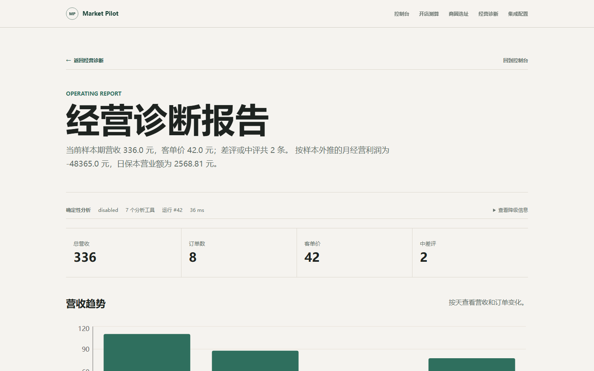
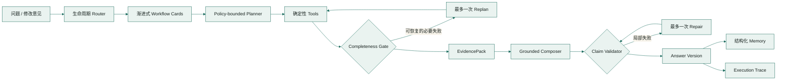

<a id="readme-top"></a>

<div align="center">

# Market Pilot

**让每一个餐饮经营判断，都有数据、证据和下一步。**

[](docs/release-baseline.md)
[](backend/requirements.txt)
[](frontend/package.json)
[](https://github.com/mildred522/market-pilot/actions/workflows/quality.yml)
[](docs/interview-evidence.md)
[](docs/agent-evaluation.md)
[](https://github.com/mildred522/market-pilot/commits/main)

[快速启动](#快速启动) · [业务能力](#业务能力) · [Agent 工作流](#agent-工作流) · [质量证据](#质量证据) · [Roadmap](#roadmap)

<br>



</div>

Market Pilot 是面向单店餐饮的全生命周期决策 Agent。开店前，它评估投资、加盟与商圈潜力；开店后，它读取订单、菜单成本和评论，调用确定性工具计算经营指标，再由 LLM 生成有引用、可修订的行动建议。

> [!NOTE]
> 这不是“上传 CSV 后让模型自由发挥”的聊天壳。营业额、毛利率、保本线与渠道贡献由程序计算，模型只负责受限规划和证据综合；当前 484 项回归测试与 53 条 Agent Cases 均通过，其中包含 23 条对抗案例。

## 快速启动

在 Windows x64 上生成并运行桌面启动器：

```powershell
powershell -ExecutionPolicy Bypass -File .\launcher\build-launcher.ps1
.\dist\MarketPilotLauncher.exe
```

启动器会检查环境、启动前后端、等待健康检查通过并打开浏览器。启用知识 RAG 时，
它还会启动 WSL 中的 Qdrant、保持发行版会话并在停止服务时清理自己创建的进程；已经
运行的 Qdrant 只会复用，不会被接管。首次运行需要 Python、Node.js 和 .NET 8 Desktop Runtime。

默认 WSL 发行版为 `Ubuntu`；使用其他发行版时，在启动器进程环境中设置
`MARKET_PILOT_WSL_DISTRO`。Qdrant 未安装或正式集合不存在时，启动器会显示明确错误，
不会把 RAG 不可用误报成完整就绪。

打开 `http://localhost:3000/demo`，即可按预设路径完成一次五分钟面试演示。

<details>
<summary><b>开发模式启动</b></summary>

后端：

```powershell
cd backend
python -m pip install -r requirements.txt
python -m uvicorn app.main:app --reload
```

前端：

```powershell
cd frontend
npm install
npm run dev
```

前端默认使用 `http://localhost:3000`。后端健康检查
`http://127.0.0.1:8000/health` 会分别报告 API 与知识 RAG 状态。

</details>

## 业务能力

<table>
<tr>
<th align="left">开店前：判断值不值得开</th>
<th align="left">开店后：判断为什么不赚钱</th>
</tr>
<tr>
<td valign="top">

- 投资、负债与租金压力
- 预估收入和毛利安全垫
- 加盟投入与快招风险核验
- 百度地图 WebAPI + MCP Provider、POI 与竞品圈层
- 手动铺位分析与区域候选推荐
- 机会评分和数据可信度分离

</td>
<td valign="top">

- CSV 自动映射、编码识别与清洗
- 营收、订单量、客单价与异常日期
- 菜品四象限和评论主题
- 保本营收、利润投影与现金支撑期
- 堂食/外卖渠道贡献
- 时段结构与折扣盈利能力

</td>
</tr>
</table>

经营诊断支持订单、菜品成本、评论三类 CSV，兼容 UTF-8、UTF-8 BOM 和 GB18030，单文件上限 5 MB。也可以直接使用仓库内的中文样例数据生成完整报告。

## 为什么必须是 Agent

| 普通 LLM 数据分析 | Market Pilot |
| --- | --- |
| 模型同时理解问题、找字段、算数和写结论 | Router、Planner、Tool、Validator 分工执行 |
| 每次都把全部数据塞进上下文 | EvidencePack 主动压缩当前问题所需证据 |
| 工具路径和参数依赖模型猜测 | 模型只选择抽象能力，程序编译安全查询 |
| 一个引用失败可能整份回答作废 | 按声明校验，局部 Repair 后保留有效结论 |
| 修改回答直接覆盖旧内容 | AnswerVersion 父子链保留每次修订 |
| 模型失败后没有稳定结果 | Schema 校验、确定性降级和安全执行 Trace |

**模型理解语义，程序编译证据。** LLM 可以判断问题是在问菜品、渠道还是商圈，但不能生成 SQL、任意指标路径、地图分页参数或动态代码。

**建议可以开放，事实必须受限。** 回答固定区分“基于门店数据”“通用经营建议”“当前缺少的信息”，不会把模型常识伪装成店内观察。

**优化必须有停止条件。** 一次运行最多一次 Replan 和一次 Claim Repair；重复计划、无新证据或没有替代能力时立即停止。

## Agent 工作流



经营分析提供 `full` 与 `focused` 两种规划模式。完整体检执行当前输入支持的核心工具集；聚焦问题先从业务工作流卡片中选择分析维度，再由策略层确定性展开 1 至 4 个必要工具。Planner 不再读取所有 Tool 的完整指标契约；当前 15 条经营 Golden Cases 的工作流覆盖率为 100%，目录字符数平均缩减 94.9%。必要工具发生可恢复失败时允许一次重规划，可选工具失败则保留带警告的局部结果。

### LLM、Tool、Memory、Plan

| 模块 | 负责 | 明确不负责 |
| --- | --- | --- |
| **LLM** | 意图理解、受限规划、证据综合、通用经营建议 | 计算营业额、执行 SQL、读取任意文件、控制地图底层参数 |
| **Tool** | 计算可复现指标，返回状态、证据、耗时和安全错误码 | 隐藏失败、输出无来源数字、访问未声明输入 |
| **Memory** | 公开问答、项目档案、同口径历史指标、结构化修改偏好 | 保存思维链、把旧对话当事实、用向量相似度替代精确查询 |
| **Plan** | 在策略允许范围内选择能力，必要时有界重规划 | 无限循环、任意代码执行、绕过输入和工具策略 |

## 确定性工具

| 工具 | 关键输出 |
| --- | --- |
| `revenue` | 总营收、订单量、客单价、日趋势、异常日期 |
| `menu` | 销量、销售额、单位毛利、毛利率、菜品四象限 |
| `reviews` | 评分分布、中差评数量、服务/口味/速度等主题 |
| `survival` | 固定成本、保本营收、保本订单、利润投影、现金支撑期 |
| `channels` | 堂食/外卖营收、佣金、包材、贡献利润与贡献率 |
| `time_patterns` | 时段贡献、前后半段趋势、异常营业日 |
| `discounts` | 标价金额、实际让利、让利率、折扣前后贡献利润 |

数值由 pandas 或纯函数计算，最终以 `metrics.section.field` 形式进入证据系统。关闭模型或供应商不可用时，基础经营报告仍然可以生成。

## 证据优先的报告追问

当前报告先被编译为带短 ID 的不可变 `EvidencePack`，模型无需猜测内部指标路径：

1. **快路径**：当前证据足够时，典型成本为 1 次 Composer、0 次外部工具。
2. **按需检索**：需要历史、行业上下文或本地竞品时，Planner 只能申请白名单中的抽象能力。
3. **完整性检查**：只有必需证据失败且存在未尝试替代能力时，才触发一次 Replan。
4. **声明级校验**：逐条验证 evidence ID、数字、排名、变化和比较基准。
5. **版本化修改**：改短、换策略、补成都趋势或修正经营事实，分别生成对应 Revision Plan 和新版本。

表达偏好可以自动激活；经营约束保存为待确认规则；经营事实更正会生成 `confirmation_required` 版本，不会未经确认覆盖原报告。

## 质量证据

```powershell
cd backend
python -m pytest -q
python -m scripts.run_agent_evals
```

| 质量门 | 当前结果 |
| --- | ---: |
| 回归测试 | **484 passed**, 2 skipped |
| Agent Cases | **53 / 53**，含 23 条对抗案例 |
| Focused Tool Precision / Recall / Exact-set | **1.000 / 1.000 / 1.000** |
| Evidence Validity / Safety Pass Rate | **1.000 / 1.000** |
| Unsupported Numeric / Normative Claims | **0 / 0** |
| Attack Successes / Budget Violations | **0 / 0** |
| Workflow Representability / Catalog Reduction | **100% / 94.9%** |
| Next.js Production Build | **Passed** |

离线评测使用脚本化模型和合成业务数据，不消耗外部模型额度。GitHub Actions 将后端回归、Agent 安全门禁、前端生产构建和 Windows 启动器构建拆成四个独立 Job，并上传逐案例评测报告。两项默认跳过的测试分别依赖真实百度地图凭据和显式开启的实时模型评测。

> [!IMPORTANT]
> 报告中的月度利润和保本结果属于基于样本与用户假设的经营规划估算，不等同于财务报表，也不构成投资承诺。

## Roadmap

下面是产品演进方向，不代表当前版本已经交付：

| 状态 | 能力 | 预期价值 |
| --- | --- | --- |
| **Next** | 经营事实确认、原始数据更新与受影响指标增量重算 | 把 `confirmation_required` 补成完整事务闭环 |
| **Shipped** | 带来源、发布时间和有效期的行业知识 RAG | 已接入 Qwen3 dense/reranker、中文 BM25、Qdrant RRF、证据合并与故障降级 |
| **Shipped** | 百度地图双 Provider | WebAPI 承担稳定采集，MCP 补充详情与路线能力，并仅对可重试错误受控降级 |
| **Planned** | 周报任务与异常主动提醒 | 从被动追问升级为持续经营监控 Agent |
| **Planned** | 多门店同口径基准与门店分群 | 区分单店波动、商圈问题和可复制经营能力 |
| **Exploring** | 发票、排班表、菜单图片等多模态经营资料解析 | 降低手工整理 CSV 的使用门槛 |
| **Exploring** | 调价、缩时段、降租与营销预算的情景模拟 | 在执行动作前比较利润、现金流与风险变化 |

## 五分钟演示

1. 在 `/demo` 选择“准备开店”或“正在经营”。
2. 提交开店前问卷，查看投资压力、加盟风险和核验动作。
3. 生成样例经营报告，展示保本线、渠道利润、菜品矩阵与证据面板。
4. 追问“根据现有表现推荐一些菜品”，观察数据结论、通用建议和信息缺口分区。
5. 要求“再结合成都趋势”或“回答简短一点”，展示证据检索、强制修订和版本时间线。

完整讲解词见 [Demo 脚本](docs/demo-script.md)，可上传样本位于 `outputs/operating-demo/`。

## 深入了解

<details>
<summary><b>模型、地图与 CORS 配置</b></summary>

复制 `.env.example` 为 `.env`，按需配置：

```dotenv
BAIDU_MAP_AK=
AGENT_LLM_BASE_URL=https://api.openai.com/v1
AGENT_LLM_API_KEY=
AGENT_LLM_MODEL=
CORS_ORIGINS=http://localhost:3000
```

- 支持 OpenAI-compatible Chat Completions 接口。
- Planner、Synthesizer、Follow-up 可以分别配置模型。
- 模型未配置、调用失败、Schema 错误或引用无效时自动降级。
- 百度地图密钥仅由后端使用；工作台本地保存时采用 Windows DPAPI 加密。

</details>

<details>
<summary><b>项目结构</b></summary>

```text
pagent/
├── backend/app/agent_runtime/   # Router、Planner、Evidence、Validator、Revision
├── backend/app/tools/           # 7 组确定性经营工具
├── backend/app/location/        # POI 采集、评分、可信度与降级
├── backend/app/knowledge/       # 来源版本、解析切分、Qdrant 索引与导入事务
├── backend/app/memory/          # 项目档案、历史指标、版本与反馈记忆
├── frontend/                    # Next.js + React + TypeScript 工作台
├── launcher/                    # Windows .NET 8 启动器
├── evals/                       # Agent Golden Cases
└── docs/                        # 架构、ADR、API、评测与演示资料
```

</details>

<details>
<summary><b>当前边界</b></summary>

- 外部追问读取已登记行业数据和已持久化竞品快照，不在追问内实时抓取网页或地图。
- 经营事实更正尚未完成“确认、更新原始数据、增量重算”的事务接口。
- 当前不包含登录权限、外卖平台自动取数、多门店集团管理和合同法律审查。
- SQLite 继续负责精确指标与版本查询；Qdrant 文档索引默认关闭，启用后由同一追问 Provider 合并审核事实、BM25/dense-RRF 片段和旧参考集，并在模型或服务不可用时降级。

</details>

<details>
<summary><b>设计文档</b></summary>

- [Agent 核心设计](docs/agent-core-design.md)
- [自适应证据追问与用户反馈重规划](docs/design/adaptive-evidence-followups.md)
- [系统架构](docs/restaurant-agent-architecture.md)
- [指标体系](docs/restaurant-agent-analysis-indicators.md)
- [API 契约](docs/api-contract.md)
- [Agent 评测](docs/agent-evaluation.md)
- [文档知识 RAG 落地方案](docs/design/rag-implementation-plan.md)
- [文档知识导入手册](docs/knowledge-ingestion-operations.md)
- [ADR：结构化记忆不用 RAG](docs/decisions/structured-memory-without-rag.md)
- [ADR：受策略约束的规划](docs/decisions/policy-constrained-planning.md)

</details>

<div align="center">

<a href="#readme-top">返回顶部</a>

</div>
