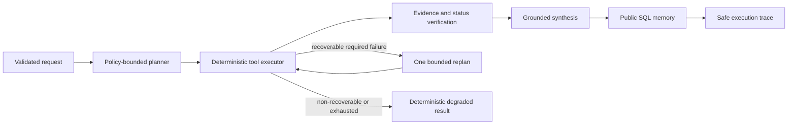

# Market Pilot Agent 核心设计

## 1. 目标

Market Pilot 面向单店餐饮经营决策，覆盖开店可行性、商圈选址和开店后经营诊断。
它不是让模型直接分析任意文件的聊天外壳，而是由 Agent 选择受限业务能力，调用
确定性工具，并对输出做证据校验、降级和追踪。

## 2. 四个核心边界

| 模块 | 负责 | 明确不负责 |
| --- | --- | --- |
| LLM | 在策略允许范围内生成计划、综合已计算指标、处理报告追问 | 计算营业额、执行 SQL、读取任意文件、控制地图底层参数 |
| Tool | pandas/纯函数计算指标，返回类型化数据、证据、状态和安全错误码 | 生成经营价值判断、隐藏失败、访问未声明输入 |
| Memory | 保存公开问答、确认后的项目事实和同口径历史指标 | 保存隐藏推理、把历史对话当作事实、做语义知识检索 |
| Plan | 在 full/focused 模式下选择白名单工具，最多重规划一次 | 无限循环、动态代码执行、绕过输入和工具策略 |

## 3. 生命周期能力

统一入口 `POST /agent/analyze` 只在三个高层能力间路由：

- `pre_open_feasibility`：用户预估值上的开店可行性规则与风险核验。
- `location_analysis`：具体铺位分析或区域候选推荐，内部封装百度 POI。
- `operating_diagnosis`：上传订单、菜品成本、评论和成本假设后的经营诊断。

路由依据是受校验的 intent 与项目 stage。模型不能设置地图关键词、分页、权重、
快照复用或事务边界。缺字段时返回精确 clarification，不会带着残缺输入启动工具。

## 4. 经营 Agent 工作流

- `full` 执行当前输入支持的完整核心工具集。
- `focused` 只允许一至四个满足策略的必要工具。
- 必需工具发生可恢复失败时最多重规划一次；可选工具失败可以输出带警告的局部结果。
- 数值结论必须解析到 `metrics.section.field` 证据路径。
- 没有商家目标或参考基准时，Agent 必须声明无法判断“高/低”或“好/差”。

## 5. 为什么计算是确定性的

营业额、订单量、客单价、菜品毛利、保本线、渠道贡献和现金支撑期由 pandas 或纯函数
工具计算。原因是这些结果需要可重复测试、精确口径和证据路径。LLM 只消费工具结果，
不能在报告中新增没有证据的数值。这一分工也让关闭模型后系统仍能返回基础诊断。

## 6. 记忆设计

SQLite/SQLAlchemy 保存三类结构化记忆：

1. 最近六条公开问答，用于对话连续性，始终标记为不可信历史上下文。
2. 用户确认的项目档案，例如城市、品类、成本假设和经营目标。
3. 同项目、同指标定义的历史值，用于精确趋势比较。

选择进入一次追问的记忆只在追踪中记录消息 ID，不复制可能含敏感内容的正文。
选择 SQL 而不是向量数据库的依据见
[ADR: Structured Memory Without RAG](decisions/structured-memory-without-rag.md)。

## 7. 可观测性与模型替换

planner、synthesizer 和 follow-up 可配置不同模型，共享显式配置的兼容供应商，不做自动
路由。每次调用记录角色、模型、响应格式、token、耗时、重试、供应商请求 ID 和失败码。
追踪表关联 request、run、analysis ID，并保存初始/修订计划、工具状态、记忆 ID、验证失败
和降级原因。追踪不保存 API Key、完整提示词、隐藏推理或未脱敏拒绝内容。

## 8. 质量门

离线评估使用 30 个脚本化案例，覆盖经营规划和报告追问。硬门禁包括证据有效性、
无虚构数值、无无依据比较、必要时拒答；focused 规划还约束 precision、recall 和 exact-set。
实时模型评估必须显式开启，十个问题各运行三次，统计 schema、证据、稳定性、延迟、token
和按外部配置价格估算的成本。当前证据见 [面试评估证据](interview-evidence.md)。

## 9. 明确延期

当前不加入向量 RAG、第二地图供应商、自动网页抓取、任意代码/SQL 工具、无限反思循环、
多 Agent 协调和多租户权限。这些功能扩大攻击面与维护面，却不提升当前求职演示的核心证据。
