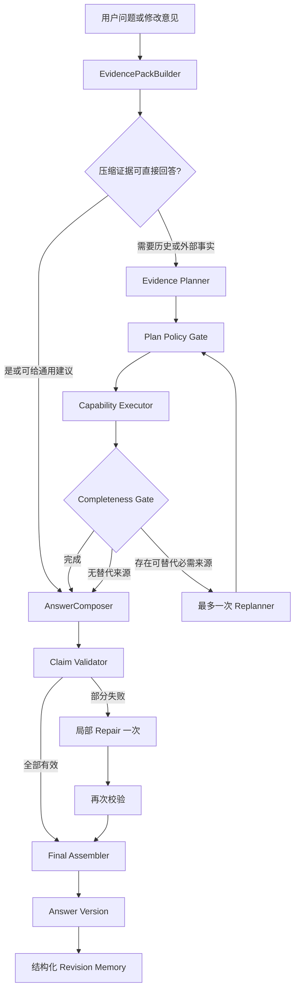

# 自适应证据追问与用户反馈重规划设计

- 状态：Approved
- 日期：2026-08-14
- 适用范围：经营报告追问、回答修订、回答版本与反馈记忆

## 1. 背景

当前报告追问采用最多四轮的只读 ReAct。模型需要同时判断数据是否存在、从长指标目录中选择
精确路径、调用工具、生成回答、填写证据引用并满足基准声明。运行时虽然允许回答校验失败后
重试，但最终仍接近回答级的全有或全无处理：一处引用或数字失败可能导致整份候选被舍弃并
退回旧报告摘要。

数组类指标不会进入标量快照。菜品、渠道明细等问题通常要求模型先正确调用
`read_metric`，再引用完整 `metrics.section.field` 路径。这提高了调用轮数，也把协议操作能力
错误地当成回答质量。为某个问题增加菜品、渠道等确定性特例只能止血，不能解决通用效率与
可恢复性问题。

本设计将追问改为 Evidence-first fast path、bounded Plan-and-Execute 和 claim-level repair。
系统主动提供压缩证据；模型负责语义理解、开放顾问建议和必要的证据需求规划；程序负责
数据访问、能力边界、数值校验、版本记录和结构化记忆。

## 2. 目标

1. 当前报告能够支持的问题通常只调用一次模型，不要求模型手写指标路径。
2. 模型可以使用通用知识提出建议，但报告数据结论与通用建议必须分区展示。
3. 缺少可选证据时继续回答可回答部分，只有对应事实依赖必需证据时才声明无法确认。
4. 校验按结论执行；错误结论修复一次，仍失败时只删除该结论。
5. 历史、外部行业和地图数据通过受限 Plan-and-Execute 获取，最多重新规划一次。
6. 用户可以要求修改当前回答，并产生可追溯的新版本。
7. 用户反馈提取为结构化记忆；不保存隐藏推理或自由文本反思文件。
8. 用跨营收、菜品、渠道、评论、生存线、历史、外部数据和反馈修改的问题集验证质量与效率。

## 3. 非目标

- 不开放任意网页、SQL、代码或文件读取工具。
- 不允许无限反思、自动持续优化或无停止条件的检索。
- 不引入向量数据库。
- 不把模型通用知识伪装为报告证据或外部事实。
- 不保存 chain-of-thought、完整提示词、未通过校验的完整候选或供应商原始响应。
- 不用 memory 掩盖产品级缺陷；系统缺陷进入代码、测试和评测集。

## 4. 设计原则

### 4.1 模型理解语义，程序编译证据

模型可以识别 `menu`、`channels`、`revenue` 等主题以及诊断、推荐、比较、改写等任务，但
不能生成数据库字段、指标路径或供应商底层参数。程序依据指标注册表把抽象证据需求编译为
实际数据查询。

### 4.2 开放顾问模式

回答固定区分：

1. **基于门店数据**：数字、比较、排名和经营状态必须引用报告、历史或外部客观证据。
2. **通用经营建议**：允许模型使用一般经营知识，但必须标记为经验性建议。
3. **当前缺少的信息**：只列出会限制进一步判断的数据，不取代整份回答。

### 4.3 重新规划只解决证据计划

Replanner 只处理必需证据检索失败、结果结构不完整或原证据源不适用。表达优化、引用修复和
用户要求改写分别由 RevisionPlanner、AnswerRepairer 处理。禁止用“可能还能更好”触发检索。

## 5. 总体架构



快路径不强制单独调用 Planner。首个模型决策允许直接返回结构化回答，或返回抽象证据需求。
当前证据足够时该调用就是 Composer；明确需要历史或外部事实时才进入 Execute 和第二次生成。
这避免为了判断是否需要规划而固定增加一次模型调用。

## 6. 核心组件

### 6.1 EvidencePackBuilder

输入为当前问题、持久化报告指标、报告摘要/风险/行动、项目事实、会话记忆和 token 预算。
输出是不可变的 `EvidencePack`：

```json
{
  "pack_id": "ep-...",
  "facts": [
    {
      "id": "E1",
      "canonical_ref": "metrics.revenue.total_revenue",
      "source": "current_report",
      "label": "总营收",
      "value": 336,
      "unit": "currency",
      "limitations": []
    }
  ],
  "report_refs": [],
  "coverage": {},
  "truncated": false
}
```

- 证据 ID 仅在一次 Agent run 内有效，最终输出映射回 canonical ref。
- 标量证据按注册表格式化；菜品、渠道和异常等有用数组按稳定规则压缩并声明截断状态。
- 小于 token 预算时提供全部压缩证据，不对用户语言做关键词到路径的硬编码。
- 超出预算时，模型只能选择主题枚举和任务枚举，程序再按注册表加载证据。
- 报告中的内部 `_agent`、密钥、原始供应商响应和未公开记忆不进入证据包。

### 6.2 Adaptive Evidence Planner

模型看到问题、证据清单、数据覆盖范围、已确认偏好和允许能力。它输出二选一决策：

- `answer_now`：当前证据足够，或开放顾问模式允许在明确边界下给通用建议。
- `retrieve`：用户要求的事实依赖当前报告之外的数据。

检索计划只能包含：

```json
{
  "answer_scope": "complete | partial_with_general_advice | fact_requires_data",
  "evidence_requests": [
    {
      "capability": "metric_history | external_industry_context | location_competitors",
      "purpose": "获取成都近期饮品趋势",
      "requirement": "required | optional",
      "success_condition": "返回带来源和时间范围的品类趋势证据"
    }
  ]
}
```

Planner 不能选择指标路径、API 参数、分页、供应商关键词、SQL 或文件。

### 6.3 Plan Policy Gate

策略层验证能力白名单、项目阶段、凭据状态、调用数量和证据需求。可选证据默认不触发高成本
检索，除非用户明确要求当前、当地、同行或精确外部事实。每次 run 的外部能力调用有显式上限。

### 6.4 Capability Executor

Executor 只获取或计算证据，不生成报告。首期能力为：

- `current_report`：读取当前 EvidencePack，快路径不记为模型工具调用。
- `metric_history`：同项目、同口径历史指标。
- `external_industry_context`：已有外部上下文仓储中带来源时间的数据。
- `location_competitors`：现有选址领域服务封装后的竞品证据。
- `recompute_metrics`：用户确认基础事实变化后重新运行受影响的确定性分析。

每个结果返回状态、证据、来源、时间范围、限制和安全错误码。

### 6.5 Completeness Gate 与 Replanner

Completeness Gate 是确定性状态检查。只有以下条件同时满足才调用一次 Replanner：

1. 失败请求被标记为 `required`；
2. 失败会阻止回答用户要求的事实；
3. 白名单中存在尚未尝试的替代能力。

Replanner 输入初始计划、已完成步骤、类型化失败和剩余能力。相同计划、无新能力或第二次失败
立即停止。可选证据失败不会触发 Replan。

### 6.6 AnswerComposer

输出结构化 `AnswerDraft`：

```json
{
  "data_findings": [
    {
      "text": "招牌拌面属于当前样本的明星菜品。",
      "evidence_ids": ["E3"]
    }
  ],
  "general_advice": [
    "可以围绕招牌产品设计小规模套餐试验。"
  ],
  "missing_information": [
    "当前没有新品需求和竞品菜单证据。"
  ]
}
```

通用建议不得声称来自报告。建议中的实验周期、预算或目标必须标记为建议参数，不能写成已观察
事实或行业标准。

### 6.7 Claim Validator 与 AnswerRepairer

Validator 逐条检查：

- evidence ID 是否存在并可映射到 canonical ref；
- 数据结论中的数字是否能在所引证据中解析，并允许注册表定义的单位转换和舍入；
- 排名、变化、因果和高低判断是否具备对应证据与基准；
- 通用建议是否冒充数据结论；
- 缺失信息是否与数据覆盖范围一致。

校验结果按 claim 记录 `valid`、`repairable` 或 `unsupported`。Repairer 只接收失败 claim、失败码
和允许证据，最多调用一次。第二次仍失败时删除失败 claim，保留所有有效内容，并将回答标记为
`partial`。系统不再因一条引用失败退回整份旧摘要。

## 7. 用户驱动重新规划

用户对某个回答提出修改时创建新的 Agent run，并由 `RevisionPlanner` 分类：

| revision_type | 示例 | 行为 |
| --- | --- | --- |
| `rewrite_only` | 回答简短一点 | 不检索，只改表达 |
| `recompose_with_existing_evidence` | 不要推荐引流菜 | 使用原证据重新组合 |
| `retrieve_more_evidence` | 再结合成都趋势 | 规划并执行新证据检索 |
| `recompute_metrics` | 租金应为 25000 | 确认事实后重新计算 |

RevisionPlanner 接收原问题、当前回答版本、原计划、证据包、用户反馈和已确认记忆。用户反馈会
强制生成 revision plan，但不会强制调用工具。每次用户消息开启新的有界执行周期，不允许系统
自行连续迭代。

## 8. 回答版本

新增 `AnswerVersion` 持久化实体：

- `id`、`analysis_id`、`conversation_id`；
- `parent_version_id`；
- 原问题与用户反馈；
- revision type、计划和执行摘要；
- 分区回答 JSON、canonical evidence refs；
- validation/repair 状态；
- 创建时间。

历史版本不可覆盖。界面默认展示最新版，并提供折叠的版本时间线、修改原因和证据变化。删除或
撤销偏好不会修改历史回答。

## 9. 结构化反馈记忆

模型可以从明确的用户反馈中提取 `RevisionLesson`，但不能持久化自由文本反思：

```json
{
  "scope": "project",
  "type": "presentation_preference | decision_constraint | analysis_preference | rejected_strategy",
  "rule": {},
  "source_version_id": 12,
  "status": "pending | active | revoked | superseded"
}
```

- 表达偏好属于低风险项，可自动激活。
- 经营事实进入现有 ProjectProfile，并要求用户确认后触发重算。
- 长期经营规则和模型提取的优化规则先保存为 pending，用户确认后激活。
- 新规则冲突时显式 supersede 旧规则，不隐式拼接。
- `MemoryContextBuilder` 每次从 SQL 生成临时上下文对象，不维护第二套上下文文件。

## 10. API 与界面兼容

追问响应保留现有 `answer`、`evidence_refs`、`mode`、`tool_calls` 和 trace 字段，并增加：

- `sections.data_findings`、`sections.general_advice`、`sections.missing_information`；
- `answer_version_id`、`parent_version_id`；
- `quality: complete | repaired | partial | insufficient`；
- `claim_validation` 的公开摘要，不暴露被拒绝的完整候选或隐藏推理。

前端固定展示三个业务分区。没有内容的分区不渲染；`insufficient` 只用于用户要求的核心事实完全
无法确认且没有可提供的通用建议。历史版本默认折叠，用户可以从任一版本提出修改，但新版本
始终挂到被修改版本下。

## 11. 调用预算与停止条件

| 场景 | 典型模型调用 | 工具调用 |
| --- | ---: | ---: |
| 当前报告问题 | 1 次 Composer | 0 |
| 当前报告 + 通用建议 | 1 次 Composer | 0 |
| 历史或外部事实 | 1 次 Planner + 1 次 Composer | 1 |
| 必需检索失败且有替代能力 | 增加 1 次 Replanner | 最多增加 1 |
| 部分 claim 校验失败 | 增加 1 次 Repairer | 0 |

一次 run 最多一次 Replan 和一次 Repair。无新证据、无替代能力、重复计划、仅表达不满意或达到
预算时必须停止。

## 12. 测试设计

### 12.1 核心问题集

| 问题 | 预期 |
| --- | --- |
| 总营收是多少？ | 一次 Composer，零工具，引用营收证据 |
| 营收、订单量和客单价有什么关系？ | 多证据回答，不要求模型读取路径 |
| 根据现有表现推荐一些菜品 | 数据结论与通用建议分区 |
| 推荐几个没卖过的新菜 | 给通用建议，并列出新品验证数据缺口 |
| 外卖为什么不赚钱？ | 使用渠道构成，不虚构因果 |
| 毛利率是不是太低？ | 无基准时展示数值但不判断高低 |
| 差评集中在哪里，怎么改？ | 评论证据 + 通用改进建议 |
| 当前最优先处理什么？ | 风险、保本线和行动证据 |
| 和上次相比营业额怎么样？ | 调用一次历史能力并校验口径 |
| 结合成都最近趋势推荐产品 | 执行外部上下文计划 |
| 附近竞品正在卖什么？ | 无数据源时只对该事实声明缺失 |

### 12.2 用户反馈问题集

| 用户反馈 | 预期 |
| --- | --- |
| 回答简短一点 | rewrite-only，新版本，零工具 |
| 不要推荐引流菜 | 使用原证据重组，新版本 |
| 再结合成都趋势分析 | retrieve-more-evidence |
| 租金不是 18000，是 25000 | 等待确认并重新计算受影响指标 |
| 以后都先给结论 | 自动保存表达偏好 |
| 以后不要推荐引流菜 | 经营规则 pending，确认后激活 |
| 撤销刚才的偏好 | 规则 revoked，历史版本不变 |

### 12.3 故障与安全问题集

- 模型引用不存在的 `E99`。
- 三条有效结论中混入一条错误数字。
- Repairer 仍返回错误引用。
- Planner 请求不允许的工具。
- 外部检索超时但存在/不存在替代能力。
- Replanner 重复相同计划。
- 新反馈与已激活记忆冲突。
- 历史版本使用不同指标定义。
- 评论或历史消息包含提示注入。

### 12.4 发布门禁

- 普通当前报告问题平均模型调用不超过 1 次，工具调用为 0。
- 需要检索的问题通常不超过 2 次模型调用和 1 次工具调用。
- Replan 与 Repair 均最多一次。
- 有效 evidence ref 为 100%。
- 无依据观察数字为 0；建议参数必须标记为 proposal。
- 至少一条有效 claim 时不得整份回退。
- 真正缺少数据时只拒绝缺失部分。
- 用户反馈生成新版本，不覆盖旧版本。
- 未确认的事实或经营规则不进入 active memory。

## 13. 迁移策略

1. 先引入 EvidencePack、claim schema 和离线评测，不改变公开 API。
2. 用新快路径替换普通 `read_metric` 循环，保留历史工具作为受限能力。
3. 引入逐 claim 校验与局部 Repair，删除菜品、渠道等类别专用确定性回答特例。
4. 引入 AnswerVersion 和 RevisionPlanner，再增加结构化反馈记忆。
5. 前端启用三分区和版本时间线后，移除旧的整份 fallback 诊断展示。

每一步都必须保持真实数据不足、基准缺失、提示注入和模型故障测试通过。旧响应字段在迁移期间
继续提供，直到前后端同时完成切换。

## 14. 2026-08-14 实施状态

已完成：

- EvidencePack、短证据 ID、预算与内部字段过滤；
- 当前报告的一次生成快路径、三分区回答、声明级数字/引用校验；
- 最多一次局部 Repair，失败后保留有效结论并返回 `partial`；
- 抽象历史/外部/本地竞品能力、策略门、持久化证据提供器和最多一次 Replan；
- 不可覆盖的 AnswerVersion 父子链、RevisionPlanner、结构化 RevisionLesson；
- 表达偏好自动激活，经营约束保持 pending，冲突规则显式 supersede；
- 前端三分区、修改当前版本、从历史版本继续修改和版本时间线；
- 菜品专用提示词与确定性菜品推荐特例已删除。

当前边界：

- 外部追问只读取已有参考数据集和已持久化竞品快照，不在追问请求内直接发起地图采集；
- 经营事实更正会生成 `confirmation_required` 版本，但确认后的原始数据更新与受影响指标重算
  仍需单独事务接口，系统当前不会未经确认覆盖报告；
- 旧的 `tool`/完整路径引用协议暂时保留用于历史客户端兼容，新提示词默认使用 EvidencePack 和
  抽象 `retrieve` 能力。
