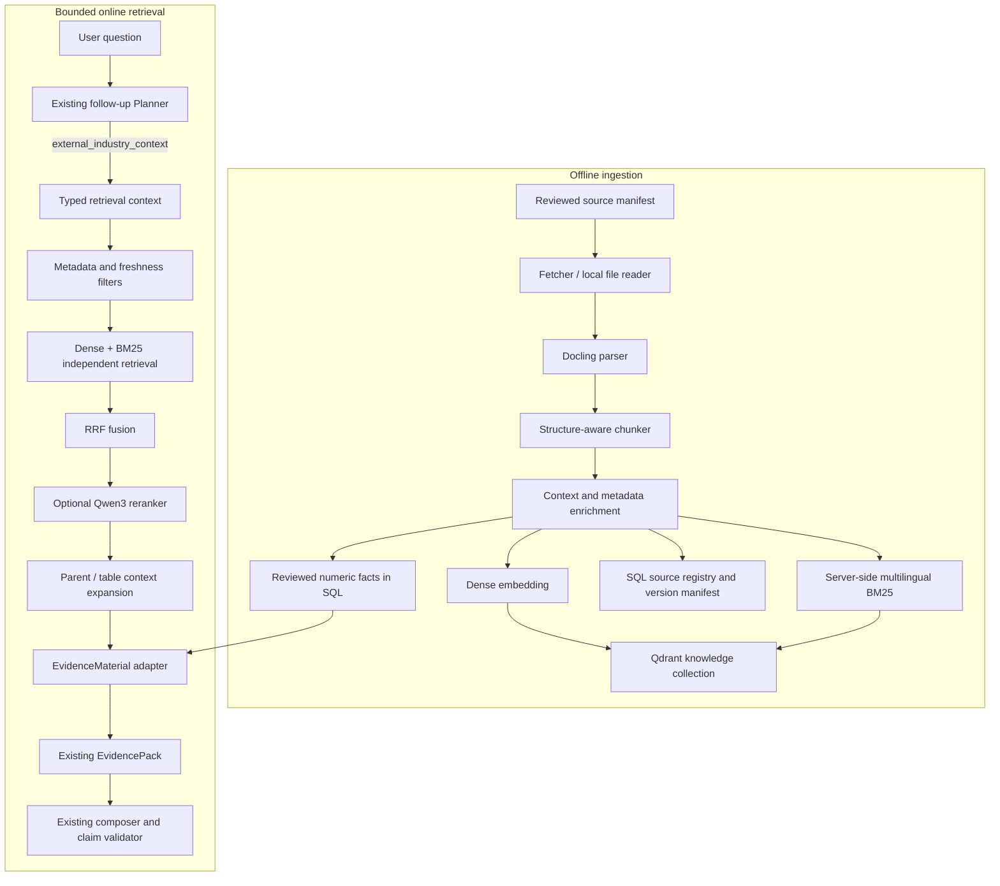

# Document Knowledge RAG Implementation Plan

## 1. Decision

Market Pilot will add a bounded document-knowledge RAG path behind the existing
`external_industry_context` capability. It will extend, not replace, the current
structured system:

- SQLite remains the source of truth for project facts, metrics, conversations,
  answer versions, curated reference facts, and knowledge-source metadata.
- Baidu Map remains a structured location tool. POI payloads do not enter RAG.
- Qdrant stores retrieval chunks with dense and sparse representations.
- Retrieved knowledge is compiled into the existing immutable `EvidencePack`.
- The current Planner, policy gate, one-Replan limit, claim validator, and answer
  revision flow remain the orchestration boundary.

The first supported corpus is maintained public knowledge for Chinese restaurant
decisions: official statistics, regulations, association reports, public company
filings, and reviewed internal methodology documents.

## 2. Goals and Non-Goals

### 2.1 Goals

1. Answer open-ended city, category, trend, regulation, and franchise questions
   with dated, attributable evidence.
2. Distinguish observed facts, forecasts, opinions, and expired material.
3. Support Chinese semantic and exact-term retrieval.
4. Degrade to curated JSON or a partial answer when RAG infrastructure fails.
5. Keep ingestion idempotent and every answer reproducible from source versions.
6. Measure retrieval quality independently from answer-generation quality.

### 2.2 Non-Goals

- Replacing SQL memory or exact metric lookup with embeddings.
- Crawling the unrestricted public web during a user request.
- Persisting raw map-provider responses.
- Building a general document-chat product or arbitrary user knowledge base.
- Introducing GraphRAG, autonomous recursive search, or unbounded reflection.
- Claiming that retrieved industry context proves a specific store will succeed.

## 3. Architecture



## 4. Component Boundaries

Add a new `backend/app/knowledge/` package:

```text
backend/app/knowledge/
  contracts.py          typed source, document, chunk, query, and hit contracts
  source_repository.py  SQL source/version/job persistence
  manifest.py           reviewed seed manifest loading and validation
  parser.py             Docling adapter; no retrieval concerns
  chunker.py            document-type policies and contextualization
  embeddings.py         dense embedding provider protocol and Qwen adapter
  qdrant_store.py       collection lifecycle, indexing, filters, hybrid query
  reranker.py           optional reranker protocol and Qwen adapter
  ingestion.py          idempotent ingestion transaction coordinator
  retriever.py          online query, fusion, expansion, and evidence conversion
  service.py            health, degradation, and application-facing facade
```

Do not introduce LangChain or LlamaIndex in the first implementation. The project
already owns planning, tools, traces, memory, and evidence contracts; another
orchestration framework would duplicate those responsibilities.

## 5. Required Contract Change

The current provider receives only a capability and project profile. That works for
exact JSON lookup but cannot retrieve passages relevant to the actual question.
Introduce a typed request while keeping the Planner away from provider parameters:

```python
class EvidenceRetrievalContext(BaseModel):
    question: str
    purpose: str
    success_condition: str
    requirement: Literal["required", "optional"]
    project_profile: dict[str, Any]
    as_of: datetime

class FollowupEvidenceProvider(Protocol):
    def retrieve(
        self,
        capability: FollowupEvidenceCapability,
        context: EvidenceRetrievalContext,
    ) -> CapabilityEvidenceResult: ...
```

`execute_followup_evidence_request()` constructs this object from the user's
question, the approved planner request, the confirmed project profile, and the
request timestamp. The model still selects only an abstract capability; it never
constructs Qdrant filters, collection names, SQL, provider keywords, or `top_k`.

## 6. Persistence Design

### 6.1 SQL entities

Add new tables without modifying existing business tables:

```text
knowledge_sources
  id, source_key(unique), title, publisher, source_type, canonical_url
  reliability_tier, default_city, default_category, status
  created_at, updated_at

knowledge_document_versions
  id, source_id, version_number, content_hash(unique per source)
  published_at, data_period_start, data_period_end
  effective_from, effective_to, fact_status
  raw_storage_path, media_type, parser_version, chunker_version
  embedding_model, index_status, indexed_at, created_at

knowledge_facts
  id, document_version_id, fact_key, label, value_json, unit
  geography, category, observed_or_forecast, source_chunk_id
  valid_from, valid_to, review_status, created_at

knowledge_ingestion_jobs
  id, document_version_id, status, stage, error_code
  chunks_parsed, chunks_indexed, started_at, finished_at
```

`knowledge_sources` describes stable provenance. A new upstream publication or
changed body creates a `knowledge_document_versions` row instead of overwriting the
old version. `knowledge_facts` is for reviewed values that require exact comparison;
it is not a mandatory extraction result for every passage.

### 6.2 Raw files

Reviewed source files are stored under `backend/storage/knowledge/raw/<source_key>/`
and excluded from Git unless licensing permits redistribution. A Git-tracked JSON
manifest contains metadata and either a public URL or an approved local path.

The database stores only paths relative to the knowledge storage root. File access
must resolve and verify that the final path remains under that root.

### 6.3 Qdrant collection

Use collection `market_pilot_knowledge_v1` with named vectors:

- `dense`: 1024-dimensional cosine vector from `Qwen3-Embedding-0.6B`.
- `sparse`: server-side `qdrant/bm25` with `tokenizer=multilingual` and IDF.

Each point uses a deterministic UUIDv5 of
`document_version_id:chunk_index:chunk_hash`. Its payload contains:

```json
{
  "source_id": 12,
  "document_version_id": 19,
  "chunk_id": "kv19-c0042",
  "parent_section_id": "kv19-s0007",
  "title": "2025年成都市经济运行情况",
  "publisher": "成都市统计局",
  "source_url": "https://example.gov.cn/report",
  "source_type": "official_statistics",
  "reliability_tier": 1,
  "published_at_ts": 1767225600,
  "data_period_start_ts": 1735689600,
  "data_period_end_ts": 1767139200,
  "effective_to_ts": null,
  "fact_status": "observed",
  "cities": ["成都"],
  "categories": ["餐饮", "新茶饮"],
  "heading_path": ["消费市场", "餐饮收入"],
  "page_start": 3,
  "page_end": 3,
  "raw_text": "...",
  "retrieval_text": "...",
  "content_hash": "sha256:..."
}
```

Create payload indexes for version status, reliability tier, dates, cities,
categories, source type, and fact status. Keep model and chunker versions in SQL so
a new embedding or chunk policy can build `v2` alongside `v1` and switch only after
evaluation.

## 7. Ingestion Pipeline

Ingestion is an explicit offline operation, not part of a follow-up request.

1. Load and validate the reviewed source manifest.
2. Download through an allowlisted `http`/`https` URL or read an approved local file.
3. Enforce content type, maximum bytes, timeout, redirect, and checksum controls.
4. Calculate SHA-256. Return `unchanged` when that version already exists.
5. Parse with Docling into headings, paragraphs, lists, tables, captions, and pages.
6. Remove navigation, scripts, repeated headers/footers, and empty fragments.
7. Chunk according to document type and the dense model tokenizer.
8. Build deterministic contextual prefixes and validate required provenance.
9. Generate dense vectors in batches; ask Qdrant to generate multilingual BM25.
10. Write all points to a staging version and verify counts and sample retrieval.
11. Mark the SQL version `active` only after the complete Qdrant upsert succeeds.
12. On failure, retain the previous active version and persist a typed job error.

The first delivery uses a CLI script such as
`python -m scripts.ingest_knowledge --manifest ...`. A public upload or crawler API
is deferred until authentication, quotas, and document ownership are designed.

## 8. Chunking and Contextualization

Use Docling's hierarchical structure first and token limits second. Do not split
every document with one global character count.

| Document type | Atomic boundary | Target tokens | Maximum | Overlap |
| --- | --- | ---: | ---: | ---: |
| Regulation | article or complete paragraph | 150-500 | 700 | 0 |
| Statistical bulletin | heading section or table row group | 250-650 | 800 | prose 40-80 |
| Industry report | heading-aware paragraph group | 350-700 | 800 | 60-100 |
| Web article | cleaned paragraph group | 300-600 | 750 | 50-80 |
| Internal methodology | one complete rule or method | 200-500 | 700 | 0-50 |

Rules:

- Never split a regulation article, list item, table row, or source citation unless
  it alone exceeds the hard maximum.
- Repeat table headers in every table chunk; store the table caption and page range.
- Merge undersized adjacent chunks only when their heading ancestry is identical.
- Store child-to-parent links. Retrieve small children, then expand the parent only
  when the child is not self-contained.
- Keep `raw_text` for quotations and `retrieval_text` for embedding separately.
- Treat chunk sizes as experiment parameters and record the policy version.

The contextual prefix is deterministic and does not require an LLM:

```text
[地区: 成都]
[品类: 新茶饮]
[来源: 中国连锁经营协会 / 美团]
[发布日期: 2023-09-20]
[数据时期: 2023]
[事实状态: observed]
[章节: 市场大盘 > 城市热力]

成都新茶饮门店数量超过6000家……
```

This prevents a small passage from losing its city, date, source, and document
meaning while keeping ingestion reproducible.

## 9. Online Retrieval

### 9.1 Query compilation

`KnowledgeQueryCompiler` receives `EvidenceRetrievalContext` and produces a typed,
deterministic `KnowledgeQuery`:

```python
class KnowledgeQuery(BaseModel):
    text: str
    city: str | None
    category: str | None
    as_of: datetime
    requires_current: bool
    allowed_source_types: tuple[str, ...]
    max_reliability_tier: int
```

The text combines the user question and approved purpose. City and category prefer
confirmed `ProjectProfile` values; aliases are normalized through a controlled
taxonomy. Keywords such as "最新" only set `requires_current`; they do not map to a
database path or source. Missing filters remain absent instead of being guessed.

### 9.2 Candidate retrieval

1. Apply active-version, reliability, geography, category, fact-status, and date
   eligibility filters.
2. Run dense retrieval and multilingual BM25 independently with `limit=30` each.
3. Fuse candidate ranks with Qdrant RRF. Do not add raw cosine and BM25 scores.
4. Deduplicate overlapping chunks from the same document section.
5. Rerank at most 30 candidates with `Qwen3-Reranker-0.6B` when enabled.
6. Select at most eight child chunks across at least two sources when available.
7. Expand parents/tables under a separate context-character budget.
8. Merge reviewed SQL facts that match the same city, category, and time scope.

One user run may issue at most two retrieval subqueries. Query decomposition is used
only for explicit compound questions, for example comparing Chengdu with the
national market; it does not recursively search based on generated answers.

### 9.3 Freshness policy

Freshness is an eligibility rule, not a vague score boost:

- `observed` facts may support factual claims inside their declared data period.
- `forecast` evidence must remain labelled as a forecast and cannot prove outcomes.
- expired regulations are excluded from current compliance answers.
- historical trend questions may include inactive periods but must preserve dates.
- "latest" requests prefer the newest eligible version per source and expose the
  newest available date when no current-period material exists.
- conflicting sources are returned together when both pass reliability policy;
  the answer states the disagreement instead of silently selecting one.

### 9.4 Evidence adaptation

Each selected passage becomes an `EvidenceMaterial` with source
`external_context` and a canonical reference such as:

```text
external.knowledge.source.12.version.19.chunk.kv19-c0042
```

Its provenance includes title, publisher, URL, publication/data period, page,
retrieval mode, reliability tier, fact status, and chunk hash. `EvidencePack` assigns
run-local short IDs as it does today. Existing answer validation therefore continues
to verify citations without exposing Qdrant details to the model or frontend.

## 10. Agent Integration and Degradation

`PersistedFollowupEvidenceProvider` becomes a composite external-context provider:

1. Query reviewed SQL facts and the existing city/category JSON repository.
2. Query `KnowledgeRetrievalService` when it is configured and healthy.
3. Merge results by canonical reference and source version.
4. Return one `CapabilityEvidenceResult` for `external_industry_context`.

The capability remains available when either curated references or RAG can answer.
Failure behavior is explicit:

| Failure | Behavior |
| --- | --- |
| Qdrant unavailable | Return curated JSON/SQL facts with a degradation limitation |
| Dense model unavailable | Use multilingual BM25 only |
| Reranker unavailable | Return RRF order and record reranker degradation |
| Document parse fails | Keep previous active source version; fail the ingestion job |
| No eligible current source | Return dated historical evidence with stale warning, or no fact |
| No evidence from any source | Existing partial/general-advice behavior; Replan only when an untried capability exists |

A degraded retriever is not considered a recoverable reason to repeat the same RAG
request. Replanning may switch to `location_competitors` or `metric_history`, never
retry an identical failed query.

## 11. Configuration and Deployment

Keep RAG optional so baseline development and tests do not download large models:

```text
KNOWLEDGE_RAG_ENABLED=false
QDRANT_URL=http://127.0.0.1:6333
QDRANT_API_KEY=
QDRANT_COLLECTION=market_pilot_knowledge_v1
KNOWLEDGE_STORAGE_ROOT=./storage/knowledge
KNOWLEDGE_DENSE_MODEL=Qwen/Qwen3-Embedding-0.6B
KNOWLEDGE_RERANKER_MODEL=Qwen/Qwen3-Reranker-0.6B
KNOWLEDGE_RERANK_ENABLED=true
KNOWLEDGE_RETRIEVAL_TIMEOUT_SECONDS=8
```

Put heavy optional dependencies in `backend/requirements-rag.txt`, including
Docling, Qdrant client, Transformers/Sentence Transformers, Torch, and model-specific
helpers. The normal `requirements.txt` remains lightweight.

Provide a Docker Compose profile for Qdrant with a named volume and health check.
The FastAPI process owns local dense/reranker model instances as lazy process-level
singletons. Ingestion batching and online queries share provider interfaces but not
mutable model state. Qdrant Edge is an experiment candidate, not the first default,
because server deployment better demonstrates health checks and operational
boundaries and currently has broader production evidence.

## 12. Security and Data Governance

- Only approved manifests and authenticated future uploads may enter ingestion.
- Reject private/link-local hosts, unsupported schemes, oversized bodies, unsafe
  redirects, and paths escaping the storage root.
- Do not execute scripts, macros, embedded objects, or instructions from documents.
- Mark retrieved document text as untrusted evidence in the model prompt. Text such
  as "ignore previous instructions" has no control authority.
- Preserve copyright metadata and avoid ingesting paywalled or unauthorized reports.
- Store only permitted excerpts/full documents and retain canonical source URLs.
- Never index API keys, raw Baidu responses, hidden memory, or internal traces.
- Enforce per-source version removal and Qdrant point deletion for takedowns.

## 13. Observability

Extend the existing trace with a public-safe retrieval summary:

```json
{
  "query_count": 1,
  "filters": {"city": "成都", "category": "新茶饮"},
  "dense_candidates": 30,
  "sparse_candidates": 26,
  "fused_candidates": 41,
  "reranked": true,
  "selected_chunks": 6,
  "source_count": 3,
  "degradations": [],
  "duration_ms": 487
}
```

Do not expose vector values, raw provider errors, hidden prompts, or rejected private
documents. Record ingestion counts, stage latency, active model/index versions,
zero-result rate, stale-result rate, and reranker fallback rate.

## 14. Evaluation Plan

Create `backend/evals/cases/knowledge_retrieval.json` with at least 50 labelled
questions across these strata:

- exact entities and policy terms;
- Chinese paraphrases and category aliases;
- city/category/date filters;
- observed fact versus forecast;
- current versus historical questions;
- table and regulation retrieval;
- source conflicts and low-reliability exclusions;
- prompt injection inside retrieved text;
- no-result and infrastructure degradation.

For every case store relevant document/chunk IDs, acceptable sources, forbidden stale
or forecast evidence, and expected answer limitations. Compare:

1. BM25 only;
2. dense only;
3. dense + BM25 + RRF;
4. dense + BM25 + RRF + reranker.

Release gates:

- Recall@10 >= 0.85;
- NDCG@5 >= 0.75;
- citation correctness >= 0.95;
- unsupported observed numeric claims = 0;
- forecast or expired evidence presented as current = 0;
- retrieval P95 excluding generation < 1.5 seconds on the demo machine;
- ordinary current-report questions still perform zero RAG calls.

## 15. Delivery Rounds

### Round 1: Contracts and persistence

- Add knowledge contracts, SQL entities, repositories, and runtime configuration.
- Introduce `EvidenceRetrievalContext` and update fake/provider contracts.
- Add a disabled `KnowledgeRetrievalService` facade and health state.
- Preserve all current behavior when `KNOWLEDGE_RAG_ENABLED=false`.

**Implementation status (2026-08-20): complete.** The typed retrieval context now
carries the approved Planner intent into providers. Source, immutable document
version, reviewed fact, and ingestion job records are persisted through an
idempotent repository. RAG configuration remains disabled by default, and its
service facade reports `disabled` or `unavailable` without invoking a backend.

Exit: model/repository/config tests pass and the full existing suite is unchanged.

### Round 2: Deterministic ingestion

- Add reviewed manifest schema, storage guards, Docling parser, chunk policies, and
  deterministic IDs.
- Add Qdrant collection creation and idempotent staging/activation.
- Add the CLI ingestion command and five representative seed documents.
- Verify tables, regulations, duplicate versions, partial failure, and rollback.

**Implementation status (2026-08-20): code and live Qdrant path complete.** Reviewed manifest validation, guarded local/HTTP acquisition, raw-file
hashing, Markdown/Docling parser boundaries, heading-aware deterministic chunks,
UUIDv5 point IDs, staging activation, rollback, CLI ingestion, and five seed sources
are implemented. The in-memory contract proves duplicate and failure behavior. The
Qdrant adapter creates 1024-dimensional dense and multilingual BM25 sparse named
vectors. Local development now targets a native Qdrant binary in the existing WSL2
Ubuntu environment; Docker Compose is optional. Qdrant 1.19.0 is installed as an
enabled loopback-only WSL user service. Local Markdown and reviewed HTML sources were
ingested into a real collection, and duplicate ingestion returned `unchanged`.
Two public PDFs remain blocked by the local proxy's streaming path, and the SAMR page
returns 403 to direct clients; TLS and redirect checks were not weakened.

Exit: ingesting the same manifest twice creates no duplicate SQL rows or points.

### Round 3: Hybrid retrieval

- Add query compiler, payload filters, Qwen3 dense embeddings, server-side
  multilingual BM25, independent prefetch branches, and RRF.
- Convert hits into `EvidenceMaterial` and merge curated JSON/SQL facts.
- Implement BM25-only and curated-only degradation.

**Implementation status (2026-08-21): dense, BM25, and RRF live paths complete.**
The deterministic query compiler normalizes city/category aliases and controls
freshness, forecast eligibility, source types, and reliability filters. Qwen3 dense
embeddings use the model's query prompt, Qdrant executes dense plus multilingual
BM25 prefetch with RRF, and hits are converted into immutable `EvidenceMaterial`.
Dense failure falls back to BM25; Qdrant failure falls back to approved SQLite facts.
Ten labelled compiler cases and mocked hybrid/curated retrieval tests pass. Real
multilingual BM25 retrieval returns cleaned report facts and methodology rules from a
15-chunk evaluated corpus. Mixed-source filtering was relaxed without treating
forecasts as observations, fixing a real zero-result failure. Qwen3-Embedding-0.6B is
cached on the local E drive and runs through CUDA on an RTX 4050 Laptop GPU. On the
50-case labelled set, reranked hybrid reached 100% chunk Hit@5, 0.975 chunk MRR@5,
and 100% expected-term hit rate at a 953.6ms warm mean latency. On the ten semantic
paraphrases it reached 100% Hit@5 and 1.00 MRR@5, compared with 70%/0.575 for BM25 and
90%/0.75 for equal RRF. The corpus is still small, so these measurements validate the
pipeline and ranking decision rather than claiming broad production quality.

Exit: hybrid retrieval beats both single retrievers on the first labelled set and
returns dated citations for Chengdu/new-tea questions.

### Round 4: Agent path

- Wire the query-aware provider into `ReportFollowupAgent`.
- Extend trace output and provenance presentation.
- Add follow-up, Replan, revision, and claim-validation tests using RAG evidence.
- Confirm ordinary report questions never initialize models or call Qdrant.

**Implementation status (2026-08-21): Provider wiring and scoped presentation complete.**
Runtime configuration now builds the optional knowledge service and injects
it into `PersistedFollowupEvidenceProvider`. Reviewed SQL facts, Qdrant chunks, and
legacy reference datasets merge by canonical reference. A real factory-to-Provider
smoke test returned eight reranked sourced facts, and the selected product-trend claim
survived EvidencePack compilation and claim validation. External, historical,
benchmark, mixed, and current-report claims now render in separate sections so industry
evidence cannot be mislabeled as store data. Missing dense or reranker weights retain
the existing BM25/RRF degradation paths.

Exit: "结合成都最近趋势推荐产品" retrieves once, answers with source/date
boundaries, and preserves the one-Replan/one-Repair limits.

### Round 5: Reranking and freshness

- Add optional Qwen3 reranking, parent expansion, conflict handling, and strict
  observed/forecast/effective-date rules.
- Add reviewed numeric-fact ingestion for high-value statistics.
- Tune chunking, candidate counts, and thresholds against the labelled set.

**Implementation status (2026-08-21): Qwen3 reranking benchmarked and integrated.**
The local-only cross-encoder reranks at most 12 RRF candidates with a 1024-token cap
and batch size one. It shares the RTX 4050 with the embedding model at roughly 2.28GiB
allocated VRAM, adds about 0.95 seconds per knowledge query, and degrades to the
original RRF order when unavailable. Parent expansion and reviewed numeric-fact
ingestion remain open.

Exit: all retrieval and factuality release gates pass without increasing no-result
failures materially.

### Round 6: Operations and portfolio finish

- Add Docker Compose profile, health endpoint, seed bootstrap, metrics, and runbook.
- Add a compact knowledge-source status view if it improves the demo.
- Update architecture, ADR, README, interview evidence, and demo script.
- Capture evaluation comparison and one end-to-end trace as portfolio evidence.

Exit: a clean machine can start Qdrant, ingest the seed corpus, run evaluation, and
demonstrate a cited answer using documented commands.

## 16. Expected File Changes

| Existing area | Change |
| --- | --- |
| `agent_runtime/contracts.py` | add retrieval context and trace summary contracts |
| `agent_runtime/followup_evidence.py` | pass query-aware context to providers |
| `external_context/followup_provider.py` | compose curated and RAG evidence |
| `agent_runtime/evidence_pack.py` | no structural rewrite; accept new materials |
| `db/models.py` | add four knowledge tables only |
| `services/runtime_config.py` | add non-secret RAG config and secret Qdrant key |
| `main.py` | initialize lightweight health facade; never eagerly load models |
| `requirements-rag.txt` | isolate optional heavy dependencies |
| `scripts/ingest_knowledge.py` | offline reviewed ingestion entry point |
| `tests/knowledge/` | parser, chunker, store, retriever, freshness, degradation tests |
| `evals/cases/knowledge_retrieval.json` | labelled retrieval benchmark |

## 17. Acceptance Scenario

Given a project profile of `city=成都` and `category=新茶饮`, existing operating
metrics, an active knowledge corpus, and the question:

> 结合成都最近的消费和新茶饮趋势，我应该优先测试什么新品？

The system must:

1. plan exactly one `external_industry_context` retrieval;
2. filter to eligible city/category/current sources;
3. retrieve independent semantic and lexical candidates and fuse them;
4. cite at least one local economic source and one category source when available;
5. distinguish observed data from forecasts and brand-sponsored opinions;
6. combine external context with current menu evidence without mixing provenance;
7. propose a small product experiment instead of claiming guaranteed demand;
8. expose missing local competitor/menu-demand evidence;
9. store the answer version and canonical evidence references;
10. stop after the bounded answer/validation path.

When Qdrant is stopped, the same request must either use maintained curated facts or
return a useful partial answer with a visible degradation limitation. It must not
fail the full report, fabricate a trend, or loop on retrieval.

## 18. Decision Checkpoint

Start Round 1 with provider contracts and disabled configuration before adding any
model dependency. The most important architectural proof is that RAG behaves like a
replaceable evidence provider inside the current Agent, not like a second application
or a replacement for deterministic analysis.
