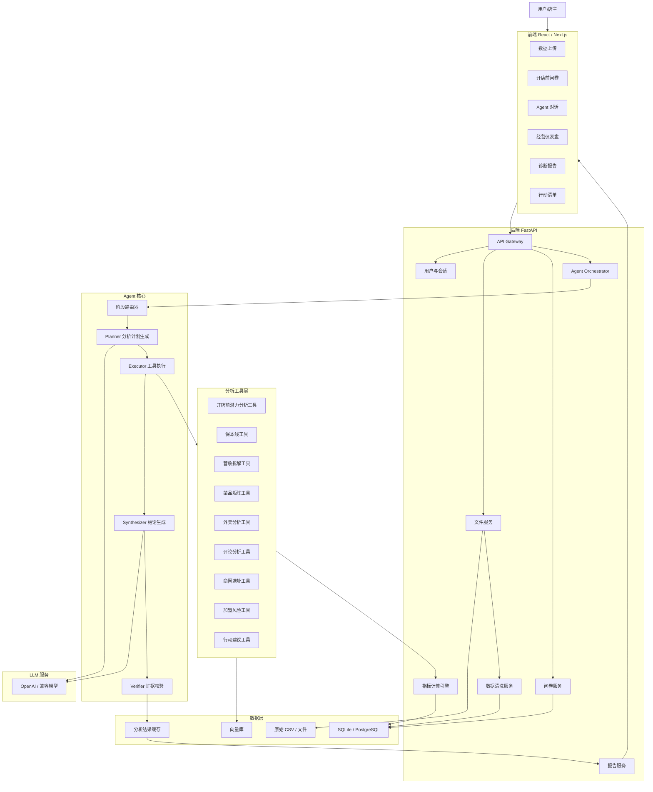
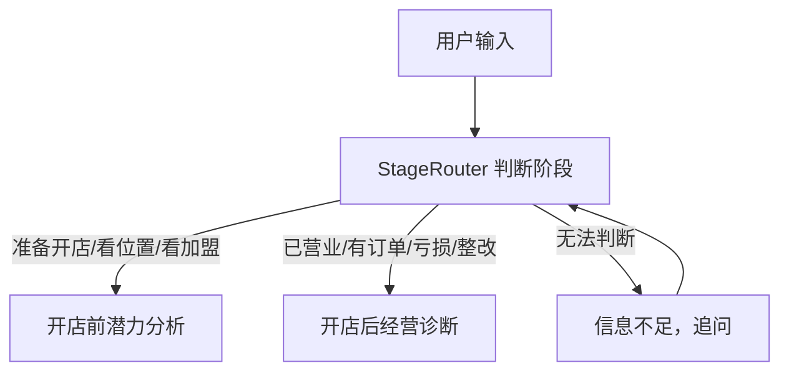
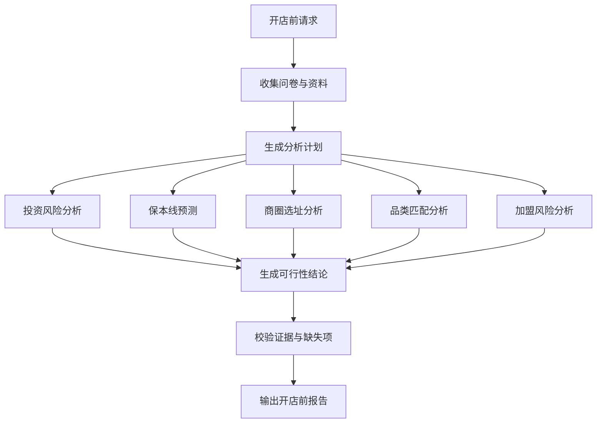
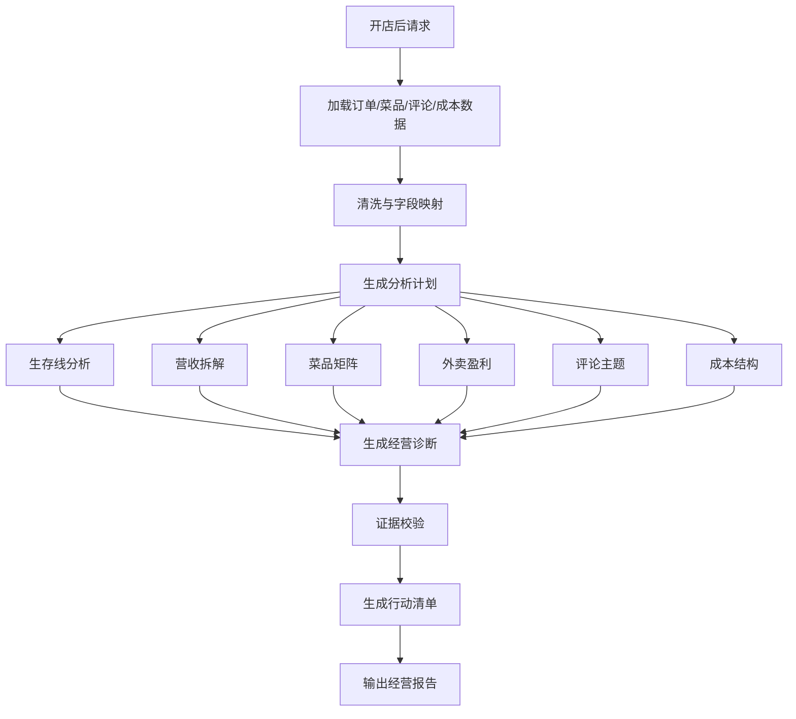
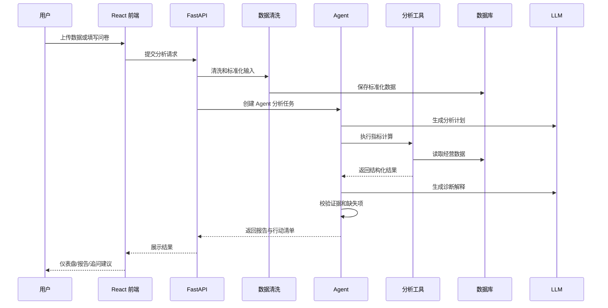

# 餐饮门店分析 Agent 架构设计

> 实现状态（2026-08-14）：本文保留产品与分层设计背景。当前 Agent
> 运行时、能力路由、记忆、评估和可观测性的准确说明以
> [Agent 核心设计](agent-core-design.md)为准。系统不再通过关键词猜测业务阶段，
> 而是使用受校验的业务意图和项目阶段进行确定性能力路由。

本文档定义项目的业务组件、系统组件、Agent 工作流、数据流和推荐架构。项目分为两个业务模块：

- 开店前潜力分析：判断“能不能开、怎么开、风险在哪里”。
- 开店后经营诊断：判断“能不能活、为什么不赚钱、怎么整改”。

## 1. 产品定位

本项目不是普通 BI 看板，也不是普通聊天机器人，而是一个面向餐饮小店的经营分析 Agent。

它的核心能力是：

1. 收集结构化数据和抽象经营信息。
2. 自动判断用户处于开店前还是开店后。
3. 根据业务阶段选择不同分析流程。
4. 调用确定性数据分析工具计算指标。
5. 使用 LLM 解释结果、归因、生成建议。
6. 输出可追溯的诊断报告和行动清单。

## 2. 总体架构



## 3. 业务模块设计

### 3.1 模块 A：开店前潜力分析

目标：帮助用户在签约、装修、加盟、投入大量资金之前判断项目是否值得做。

核心输入：

- 店主背景：经验、资金、负债、是否全职。
- 品类计划：卖什么、价格带、目标客群、制作复杂度。
- 投资预算：加盟费、装修、设备、转让费、房租押金、流动资金。
- 租赁条件：租金、面积、合同期限、免租期、递增条款。
- 商圈信息：位置、客流、竞品、目标客群、门头可见性。
- 加盟资料：品牌、合同、费用结构、直营店、加盟店、承诺回本周期。

核心分析：

- 投资额是否过重。
- 保本营业额是否现实。
- 商圈客流是否支撑该品类。
- 产品价格带是否匹配目标客群。
- 加盟品牌是否有快招风险。
- 店主资金和经验是否能承受试错。

核心输出：

- 开店可行性评分。
- 投资风险等级。
- 商圈匹配度。
- 品类匹配度。
- 加盟风险等级。
- 预估保本营业额。
- 预估回本周期。
- 是否建议开店。
- 必须补充调研的问题。

### 3.2 模块 B：开店后经营诊断

目标：帮助已经开店的用户判断经营问题来源，并给出整改或止损建议。

核心输入：

- 订单数据。
- 菜品成本数据。
- 外卖平台数据。
- 顾客评论数据。
- 固定成本数据。
- 排班数据。
- 活动数据。
- 店主补充问答。

核心分析：

- 是否达到保本线。
- 营收变化来自订单数、客单价、渠道还是时段。
- 毛利是否被食材、房租、人工、平台佣金、活动补贴侵蚀。
- 菜品结构是否健康。
- 外卖是否真实盈利。
- 差评是否集中在菜品、服务、出餐、配送或环境。
- 当前是可救、观察还是止损。

核心输出：

- 经营健康度评分。
- 盈亏诊断。
- 营收下滑归因。
- 菜品四象限。
- 外卖盈利分析。
- 评论主题分析。
- 现金流预警。
- 整改行动清单。
- 止损条件。

## 4. 前端组件

### 4.1 页面级组件

- `LandingPage`：项目入口，展示两个业务入口。
- `PreOpenAnalysisPage`：开店前潜力分析页面。
- `OperationDiagnosisPage`：开店后经营诊断页面。
- `DashboardPage`：指标看板。
- `AgentChatPage`：Agent 对话和追问。
- `ReportPage`：诊断报告详情。
- `ProjectHistoryPage`：历史分析记录。

### 4.2 业务组件

- `BusinessStageSelector`：选择开店前或开店后。
- `PreOpenQuestionnaire`：开店前问卷。
- `StoreProfileForm`：门店基础画像。
- `FileUploader`：上传订单、菜品、评论、外卖数据。
- `DataMappingTable`：CSV 字段映射和校验。
- `MetricCardGrid`：核心指标卡片。
- `RevenueTrendChart`：营收趋势图。
- `ChannelMixChart`：渠道结构图。
- `MenuMatrixChart`：菜品四象限图。
- `ReviewTopicPanel`：评论主题分布。
- `RiskScorePanel`：风险评分。
- `EvidencePanel`：结论证据引用。
- `ActionList`：行动清单。
- `FollowUpQuestions`：Agent 追问建议。

## 5. 后端组件

### 5.1 API 层

- `analysis_api`：创建分析任务、获取分析结果。
- `upload_api`：文件上传、字段映射、文件解析。
- `questionnaire_api`：保存开店前问卷。
- `chat_api`：Agent 对话。
- `report_api`：报告生成、导出。
- `project_api`：门店项目管理。

### 5.2 服务层

- `FileService`：保存原始文件，记录文件元数据。
- `DataCleaningService`：清洗 CSV、修正时间、金额、缺失值和重复数据。
- `SchemaMappingService`：将用户 CSV 字段映射到系统标准字段。
- `MetricEngine`：计算确定性经营指标。
- `AgentOrchestrator`：调度 Planner、Executor、Synthesizer、Verifier。
- `ReportService`：把结构化分析结果渲染成报告。
- `TaskService`：生成和管理整改行动清单。

### 5.3 Agent 层

- `StageRouter`：判断用户是开店前还是开店后。
- `Planner`：根据问题生成分析计划。
- `Executor`：调用工具执行计划。
- `ToolRegistry`：注册所有可用分析工具。
- `Synthesizer`：把工具结果汇总成自然语言诊断。
- `Verifier`：检查结论是否有数据证据支撑。
- `MemoryStore`：保存本次分析上下文和用户补充信息。

## 6. 分析工具层

### 6.1 开店前工具

- `investment_risk_analyzer`：投资额、负债、回本周期和抗风险能力。
- `break_even_forecaster`：预估保本营业额和保本订单数。
- `location_fit_analyzer`：商圈、位置、客流、目标客群匹配。
- `category_fit_analyzer`：品类、价格带、消费频次和操作难度。
- `competitor_analyzer`：竞品数量、价格带、优势和威胁。
- `franchise_risk_analyzer`：加盟品牌和快招风险判断。
- `pre_open_recommendation_generator`：生成是否建议开店和调整方案。

### 6.2 开店后工具

- `survival_line_analyzer`：保本线、固定成本、现金流。
- `revenue_analyzer`：营收趋势、订单数、客单价、时段拆解。
- `channel_analyzer`：堂食、外卖、团购、私域渠道表现。
- `menu_matrix_analyzer`：菜品销量、毛利和四象限。
- `delivery_profit_analyzer`：外卖佣金、满减、包材、配送和净利。
- `review_topic_analyzer`：评论情绪和差评主题。
- `cost_structure_analyzer`：房租、人工、食材、活动等成本结构。
- `anomaly_detector`：识别异常下滑、异常成本、异常差评。
- `operation_recommendation_generator`：生成整改动作和止损条件。

## 7. 数据模型

### 7.1 核心实体

- `users`：用户。
- `store_projects`：门店项目。
- `store_profiles`：门店基础画像。
- `pre_open_surveys`：开店前问卷。
- `uploaded_files`：上传文件。
- `orders`：订单明细。
- `order_items`：订单菜品明细。
- `menu_items`：菜品与成本。
- `reviews`：顾客评论。
- `fixed_costs`：固定成本。
- `staff_schedules`：排班。
- `marketing_campaigns`：活动记录。
- `analysis_runs`：分析任务。
- `analysis_results`：分析结果。
- `agent_messages`：Agent 对话。
- `action_items`：行动清单。

### 7.2 分析任务状态

```json
{
  "analysis_id": "uuid",
  "stage": "pre_open | operating",
  "user_question": "最近营业额下降是为什么？",
  "intent": "revenue_drop_diagnosis",
  "required_inputs": ["orders", "menu_items", "fixed_costs", "reviews"],
  "available_inputs": ["orders", "menu_items", "reviews"],
  "missing_inputs": ["fixed_costs"],
  "plan": [],
  "tool_results": [],
  "evidence": [],
  "final_report": {},
  "warnings": []
}
```

## 8. Agent 工作流

### 8.1 阶段路由



### 8.2 开店前分析流



### 8.3 开店后分析流



## 9. 数据流



## 10. 推荐技术栈

- 前端：React / Next.js / TypeScript。
- UI：Tailwind CSS 或 shadcn/ui。
- 图表：ECharts 或 Recharts。
- 后端：Python FastAPI。
- 数据分析：pandas。
- 数据库：SQLite 起步，后续 PostgreSQL。
- 向量库：Chroma 或 pgvector，用于加盟资料、合同、评论、知识文档检索。
- LLM：OpenAI API 或兼容接口。
- 报告：Markdown 渲染，后续支持 PDF 导出。

## 11. 为什么采用 Plan-and-Execute

餐饮诊断不是单次问答，而是多步骤分析：

1. 识别业务阶段。
2. 判断用户意图。
3. 检查已有数据和缺失数据。
4. 生成分析计划。
5. 调用多个工具计算指标。
6. 对结果做归因。
7. 校验证据。
8. 生成建议。

Plan-and-Execute 比普通 ReAct 更适合这个项目，因为经营分析需要明确的分析步骤和可解释的工具结果。ReAct 更适合开放式探索，Plan-and-Execute 更适合结构化诊断。

## 12. MVP 架构范围

第一版建议只实现以下闭环：

### 开店前

- 开店前问卷。
- 投资预算录入。
- 商圈与加盟风险问答。
- 保本营业额预测。
- 开店可行性报告。

### 开店后

- 订单 CSV 上传。
- 菜品成本 CSV 上传。
- 顾客评论 CSV 上传。
- 保本线计算。
- 营收拆解。
- 菜品四象限。
- 评论主题分析。
- Agent 诊断报告。

### 暂不实现

- 实时外卖平台接入。
- 自动爬取竞品。
- 多门店管理。
- 复杂权限系统。
- 现场视频分析。
- 自动 PDF 排版。
