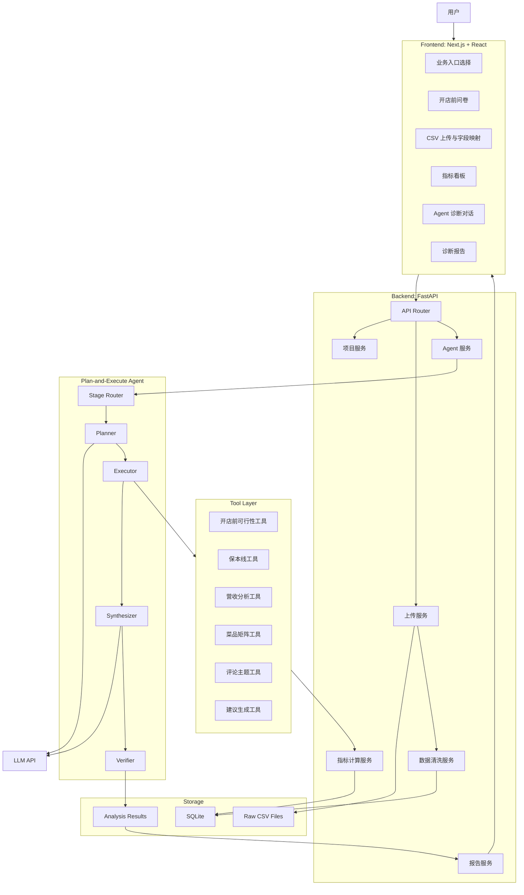
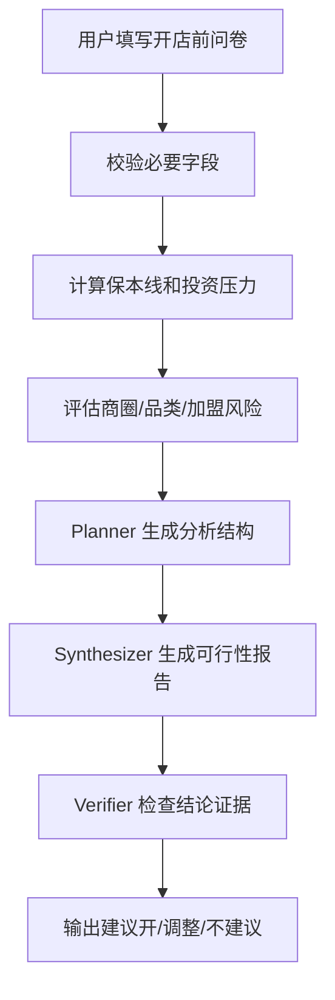
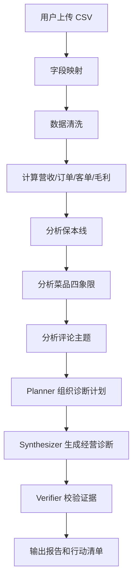

# 餐饮门店分析 Agent MVP 架构方案

## 1. MVP 目标

第一版只做一个能演示完整价值闭环的产品：

> 用户选择“开店前潜力分析”或“开店后经营诊断”，录入问卷或上传 CSV，系统完成数据清洗、指标计算、Agent 诊断、证据展示和行动建议输出。

MVP 不追求覆盖全部餐饮场景，重点证明：

1. 业务分流清晰：开店前和开店后走不同流程。
2. Agent 不是聊天套壳：能规划、调用工具、整合证据、生成报告。
3. 数据分析可靠：核心指标由 pandas/SQL 计算，不让 LLM 猜数。
4. 产品可演示：有上传、看板、诊断报告和行动清单。

## 2. MVP 功能范围

### 2.1 开店前潜力分析

第一版做“问卷 + 计算 + 风险诊断”，不做外部自动采集。

必须支持：

- 门店基础信息录入。
- 投资预算录入。
- 租金、面积、座位数、预计客单价、预计订单数录入。
- 是否加盟、加盟费、品牌承诺、供货限制录入。
- 商圈类型、竞品数量、门头可见性、目标客群录入。
- 预估保本营业额。
- 预估保本订单数。
- 投资风险评分。
- 商圈匹配度评分。
- 加盟/快招风险提示。
- “建议开 / 调整后再开 / 不建议开”结论。

暂不支持：

- 自动识别门店照片。
- 自动爬取竞品。
- 自动校验加盟品牌工商信息。
- 合同全文审查。

### 2.2 开店后经营诊断

第一版做“订单 CSV + 菜品成本 CSV + 评论 CSV”的经营诊断。

必须支持：

- 上传订单 CSV。
- 上传菜品成本 CSV。
- 上传评论 CSV。
- CSV 字段映射。
- 数据清洗和错误提示。
- 日营业额、订单数、客单价计算。
- 毛利、毛利率、菜品毛利贡献计算。
- 保本营业额计算。
- 营收趋势和时段拆解。
- 菜品四象限。
- 评论差评主题分析。
- 经营健康度评分。
- 整改行动清单。

暂不支持：

- 外卖平台实时 API。
- 多门店对比。
- 排班优化。
- 库存供应链分析。
- 自动 PDF 导出。

## 3. MVP 总体架构



## 4. 前端 MVP 组件

### 4.1 页面

- `HomePage`：两个入口，开店前潜力分析和开店后经营诊断。
- `PreOpenPage`：开店前问卷和分析结果。
- `OperatingPage`：CSV 上传、字段映射、经营诊断。
- `AnalysisReportPage`：展示单次分析报告。

### 4.2 核心组件

- `StageSelector`：选择业务模块。
- `PreOpenForm`：开店前问卷。
- `CsvUploader`：上传订单、菜品成本、评论文件。
- `ColumnMapper`：把用户字段映射到标准字段。
- `MetricCards`：展示营业额、订单数、客单价、毛利率、保本线。
- `RevenueChart`：营收趋势。
- `MenuMatrix`：菜品四象限。
- `ReviewTopics`：差评主题。
- `AgentReport`：诊断结论、证据、建议。
- `ActionList`：本周行动清单和观察指标。

## 5. 后端 MVP 组件

### 5.1 API

- `POST /projects`：创建门店项目。
- `POST /pre-open/analyze`：提交开店前问卷并分析。
- `POST /files/upload`：上传 CSV。
- `POST /files/{file_id}/map-columns`：提交字段映射。
- `POST /operating/analyze`：创建开店后经营诊断任务。
- `GET /analysis/{analysis_id}`：获取分析结果。

### 5.2 服务

- `ProjectService`：管理门店项目和业务阶段。
- `UploadService`：保存上传文件和元数据。
- `SchemaMappingService`：校验 CSV 字段是否满足分析要求。
- `DataCleaningService`：清洗时间、金额、空值、重复订单。
- `MetricService`：计算所有确定性指标。
- `AgentService`：执行 Plan-and-Execute 流程。
- `ReportService`：生成结构化报告。

## 6. MVP 数据模型

### 6.1 最小表设计

```text
projects
- id
- name
- stage
- created_at

pre_open_inputs
- id
- project_id
- category
- city
- location_type
- area_sqm
- seats
- monthly_rent
- total_investment
- own_capital
- debt_amount
- expected_daily_orders
- expected_avg_order_value
- expected_gross_margin
- is_franchise
- franchise_fee
- competitor_count
- storefront_visibility

uploaded_files
- id
- project_id
- file_type
- original_name
- storage_path
- created_at

orders
- id
- project_id
- order_id
- order_time
- channel
- item_name
- quantity
- actual_amount

menu_items
- id
- project_id
- item_name
- category
- sale_price
- unit_cost

reviews
- id
- project_id
- review_time
- rating
- content
- channel

analysis_runs
- id
- project_id
- stage
- intent
- status
- created_at

analysis_results
- id
- analysis_id
- summary
- metrics_json
- evidence_json
- actions_json
- warnings_json
```

## 7. Agent MVP 工作流

### 7.1 开店前工作流



### 7.2 开店后工作流



## 8. Agent 与普通程序的边界

确定性计算交给程序：

- 营业额。
- 订单数。
- 客单价。
- 毛利率。
- 保本营业额。
- 菜品销量。
- 菜品毛利。
- 评论关键词频率。

Agent 负责：

- 判断用户意图。
- 选择分析流程。
- 判断数据缺失并追问。
- 组织多个工具结果。
- 做经营归因。
- 给出带优先级的行动建议。
- 解释为什么建议开、整改或止损。

## 9. MVP 目录结构

```text
restaurant-agent/
  frontend/
    app/
      page.tsx
      pre-open/page.tsx
      operating/page.tsx
      analysis/[id]/page.tsx
    components/
      StageSelector.tsx
      PreOpenForm.tsx
      CsvUploader.tsx
      ColumnMapper.tsx
      MetricCards.tsx
      RevenueChart.tsx
      MenuMatrix.tsx
      ReviewTopics.tsx
      AgentReport.tsx
      ActionList.tsx

  backend/
    app/
      main.py
      api/
        projects.py
        pre_open.py
        files.py
        operating.py
        analysis.py
      services/
        project_service.py
        upload_service.py
        schema_mapping_service.py
        data_cleaning_service.py
        metric_service.py
        agent_service.py
        report_service.py
      agents/
        state.py
        router.py
        planner.py
        executor.py
        synthesizer.py
        verifier.py
        prompts.py
      tools/
        pre_open_tool.py
        break_even_tool.py
        revenue_tool.py
        menu_tool.py
        review_tool.py
        recommendation_tool.py
      db/
        models.py
        session.py
      tests/
```

## 10. MVP 开发顺序

### Phase 1：后端数据与指标闭环

目标：不依赖前端，先通过 API 跑通分析。

交付：

- FastAPI 项目。
- SQLite 数据库。
- CSV 上传。
- 字段映射。
- 数据清洗。
- 保本线、营收、菜品、评论基础分析。

### Phase 2：Agent 诊断闭环

目标：让 Agent 基于工具结果生成结构化报告。

交付：

- Stage Router。
- Planner。
- Executor。
- Synthesizer。
- Verifier。
- 开店前报告。
- 开店后报告。

### Phase 3：前端可演示闭环

目标：做出能面试展示的产品界面。

交付：

- 两个业务入口。
- 开店前问卷。
- 开店后 CSV 上传。
- 指标卡片。
- 图表。
- 诊断报告。
- 行动清单。

### Phase 4：样例数据与演示脚本

目标：保证项目能稳定演示。

交付：

- 示例订单 CSV。
- 示例菜品成本 CSV。
- 示例评论 CSV。
- 一个亏损门店案例。
- 一个准备加盟开店案例。
- README 演示流程。

## 11. MVP 不做什么

第一版明确不做：

- 登录注册复杂权限。
- 支付。
- 多租户。
- 真实外卖平台 API。
- 真实地图 API。
- 自动爬虫。
- 视频识别。
- 合同全文法律审查。
- 大规模 RAG 知识库。
- 多门店集团管理。

这些功能会让项目变成餐饮 SaaS，而不是求职项目 MVP。

## 12. 面试讲法

可以这样介绍：

> 这个项目是一个面向餐饮小店的经营分析 Agent。它分为开店前潜力分析和开店后经营诊断两个业务模块。前者通过投资预算、商圈、品类和加盟风险判断项目能不能开；后者通过订单、菜品成本和评论数据判断门店为什么不赚钱。系统采用 React + FastAPI + pandas + Plan-and-Execute Agent 架构，确定性指标由程序计算，LLM 负责规划分析、归因解释和行动建议生成。

