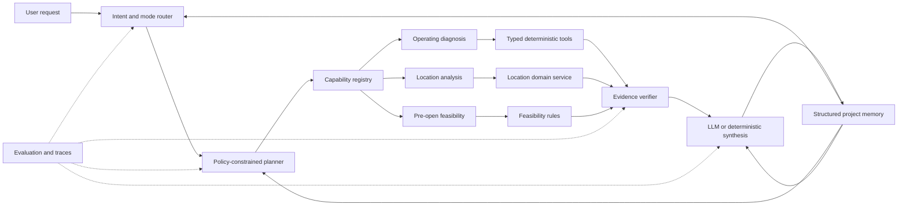

# Agent Core Evolution Implementation Plan

> **For agentic workers:** REQUIRED SUB-SKILL: Use superpowers:subagent-driven-development (recommended) or superpowers:executing-plans to implement this plan task-by-task. Steps use checkbox (`- [ ]`) syntax for tracking.

**Goal:** Evolve Market Pilot from an operating-analysis workflow containing an Agent into a measurable, stateful, policy-constrained Agent that can consistently coordinate pre-open, location, and operating capabilities.

**Architecture:** Keep deterministic business calculations inside typed tools and domain services. Let the LLM perform intent interpretation, bounded planning, evidence-grounded synthesis, and report follow-up under explicit policies. Add SQL-backed structured memory and an evaluation harness before expanding autonomy; do not add embeddings or a vector database in this cycle.

**Tech Stack:** Python 3.11+, FastAPI, Pydantic, SQLAlchemy, SQLite, pandas, pytest, Next.js 16, React 19, TypeScript.

---

## 1. Delivery Principles

1. Each phase must leave the application runnable and independently demonstrable.
2. Evaluation is implemented before autonomy changes so baseline and regression results are comparable.
3. The LLM never calculates business metrics or directly accesses files, SQL, or provider APIs.
4. Tools return structured facts; policies decide whether a tool may run; the LLM explains verified results.
5. Memory is structured SQL data first. SQLite FTS or vector retrieval is deferred until exact retrieval becomes insufficient.
6. Do not turn every service method into an LLM tool. Expose bounded business capabilities at the correct abstraction level.
7. The complete backend suite, frontend build, and phase-specific acceptance tests must pass before moving forward.

## 2. Target Architecture

The architecture uses two planning levels:

- **Request plan:** chooses a high-level capability such as operating diagnosis or location analysis.
- **Capability plan:** chooses only the bounded tools inside that capability.

Location collection, pagination, snapshot reuse, and scoring remain deterministic internals of `LocationAnalysisService`; they are not exposed as arbitrary low-level LLM tools.

## 3. Phase Overview

| Phase | Theme | Primary outcome | Exit gate |
|---|---|---|---|
| 0 | Release baseline | Current feature work is reproducible and merged cleanly | Clean worktree and all existing verification passes |
| 1 | Agent evaluation | Offline golden cases measure current behavior | Baseline report generated from at least 30 cases |
| 2 | Tool contracts | All Agent-visible tools use one typed execution envelope | Tool contract and partial-failure tests pass |
| 3 | Real planning | Focused questions select a minimal tool set | Planner selection meets evaluation thresholds |
| 4 | Structured memory | Follow-ups and projects retain useful state across requests | Multi-turn and historical comparison tests pass |
| 5 | Unified capabilities | One request router can invoke all three business capabilities | Cross-capability routing tests pass |
| 6 | LLM operations | Cost, latency, usage, fallback, and provider behavior are observable | Trace completeness and live smoke tests pass |
| 7 | Interview release | Architecture, evaluation evidence, and demo are packaged | Five-minute demo and fresh-machine run succeed |

---

## Phase 0: Stabilize the Existing Baseline

**Purpose:** Preserve the current working system before changing Agent behavior. This phase contains no new business capability.

### Task 0.1: Resolve and commit current Agent changes

**Files:**
- Review: `backend/app/agent_runtime/metric_registry.py`
- Review: `backend/app/agent_runtime/followup.py`
- Review: `backend/tests/test_metric_registry.py`
- Review: `backend/tests/test_agent_followup.py`
- Review: `launcher/MarketPilot.Launcher/Program.cs`
- Modify: `README.md`

- [x] Separate metric registry, follow-up hardening, operating targets, and launcher changes into coherent commits.
- [x] Correct README drift: four follow-up rounds, implemented map analysis, and actual launcher prerequisites.
- [x] Ensure generated launcher `bin`, `obj`, `dist`, database, upload, and local artifact directories are ignored.
- [x] Run `git diff --check` and confirm no conflict markers or accidental generated files are tracked.

### Task 0.2: Record the release baseline

**Test:** complete project verification

- [x] Run `cd backend; python -m pytest -q`.
- [x] Run `cd frontend; npm run build`.
- [x] Run `dotnet build launcher/MarketPilot.Launcher/MarketPilot.Launcher.csproj --configuration Release`.
- [x] Record Python, Node, npm, and .NET versions in `docs/release-baseline.md`.
- [x] Merge the feature branch only after the worktree is clean and all three checks pass.

**Exit gate:** The current verified result of 310 passing backend tests, one opt-in skip, a successful frontend build, and a warning-free launcher build is reproducible from the merged branch.

---

## Phase 1: Build the Agent Evaluation Foundation

**Purpose:** Measure current Agent behavior before modifying the planner or memory. Unit tests prove mechanics; this phase evaluates decisions and answers.

### Task 1.1: Define evaluation contracts

**Files:**
- Create: `backend/app/evals/contracts.py`
- Create: `backend/app/evals/runner.py`
- Create: `backend/app/evals/scorers.py`
- Create: `backend/tests/evals/test_eval_scorers.py`

Define a case with these fields:

- `case_id`, `stage`, `question`, and fixture references.
- `analysis_mode`: `full` or `focused`.
- Expected and forbidden tools.
- Required and forbidden evidence references.
- Whether a benchmark disclaimer or insufficient-data result is required.
- Expected answer facts expressed as structured predicates, not exact prose.

Define aggregate metrics:

- Tool precision, recall, and exact-set accuracy.
- Evidence reference validity.
- Required-fact coverage.
- Unsupported numerical claim count.
- Unsupported normative claim count.
- Correct abstention rate.
- Deterministic fallback rate and reason distribution.

### Task 1.2: Create an offline golden dataset

**Files:**
- Create: `backend/evals/cases/operating.json`
- Create: `backend/evals/cases/followup.json`
- Create: `backend/evals/fixtures/`
- Create: `backend/tests/evals/test_offline_agent_eval.py`

- [x] Add at least 15 operating-plan cases covering revenue, menu, reviews, time pattern, discounts, survival, and channels.
- [x] Add at least 15 follow-up cases covering exact metric reads, missing data, old reports, invalid references, merchant targets, and absent benchmarks.
- [x] Include adversarial text in review content to verify source text cannot alter Agent instructions.
- [x] Keep offline cases deterministic by using scripted LLM clients and synthetic business fixtures.

### Task 1.3: Generate a baseline report

**Files:**
- Create: `backend/scripts/run_agent_evals.py`
- Create: `outputs/evals/.gitkeep`
- Modify: `.gitignore`

- [x] Generate machine-readable JSON and a concise Markdown summary.
- [x] Record the current all-tools planner behavior as the baseline rather than changing it in this phase.
- [x] Fail CI only on hard safety invariants initially: invalid evidence, invented numerical facts, or failure to abstain when required.

**Exit gate:** At least 30 offline cases run with a reproducible report. Evidence validity is 100%, unsupported numeric claims are zero, and all baseline planning metrics are recorded.

---

## Phase 2: Introduce Typed Tool Execution Contracts

**Purpose:** Make tools uniformly observable and allow partial success without weakening evidence rules.

### Task 2.1: Add a typed tool result envelope

**Files:**
- Create: `backend/app/agent_runtime/tool_contracts.py`
- Modify: `backend/app/agent_runtime/tools.py`
- Modify: `backend/app/agent_runtime/orchestrator.py`
- Test: `backend/tests/test_tool_contracts.py`

The envelope must contain:

- `tool_name`, `output_section`, and `status` (`completed`, `degraded`, `failed`).
- Typed or validated `data`.
- `evidence`, `warnings`, and a safe error code.
- `duration_ms` and whether the result came from cache.

Do not include raw exceptions, credentials, arbitrary provider payloads, or chain-of-thought.

- [x] Implement and validate the typed execution envelope for every operating tool.

### Task 2.2: Move registry mappings into one source of truth

**Files:**
- Modify: `backend/app/agent_runtime/tools.py`
- Modify: `backend/app/agent_runtime/metric_registry.py`
- Delete after migration: `_result_key` in `backend/app/agent_runtime/tools.py`
- Test: `backend/tests/test_metric_registry.py`

- [x] Make each `ToolSpec` own its output section and output contract.
- [x] Validate at startup or in tests that every public output path has a metric definition.
- [x] Reject duplicate tool names and output sections.

### Task 2.3: Support bounded partial failure

**Files:**
- Modify: `backend/app/agent_runtime/orchestrator.py`
- Modify: `backend/app/agent_runtime/synthesis.py`
- Modify: `backend/app/agent_runtime/contracts.py`
- Test: `backend/tests/test_agent_orchestrator.py`

- [x] Continue when an optional tool fails and return a degraded report with explicit missing sections.
- [x] Stop when a required tool for the requested question fails.
- [x] Ensure the synthesizer receives only completed or degraded validated data.
- [x] Add failed-tool details to the trace without exposing sensitive content.

**Exit gate:** Every Agent-visible operating tool returns the same envelope, partial failures are deterministic, and all prior report fields remain backward compatible.

---

## Phase 3: Make Planning Genuinely Selective

**Purpose:** Replace the current appearance of dynamic planning with policy-bounded but meaningful tool selection.

### Task 3.1: Add explicit analysis modes

**Files:**
- Modify: `backend/app/schemas/operating.py`
- Modify: `frontend/components/CsvUploader.tsx`
- Modify: `frontend/lib/types.ts`
- Test: `backend/tests/test_operating_api.py`

Add two modes:

- `full`: run the complete seven-tool operating health check.
- `focused`: choose the minimum sufficient tool set for the user's question.

Default uploaded-data analysis to `full` so existing behavior remains stable. Use `focused` for targeted follow-up-like diagnosis.

- [x] Propagate explicit `full` and `focused` modes through API, service, runtime, trace, evaluation, and UI.

### Task 3.2: Replace the all-tools policy

**Files:**
- Modify: `backend/app/agent_runtime/planning.py`
- Modify: `backend/app/agent_runtime/tools.py`
- Create: `backend/app/agent_runtime/plan_policy.py`
- Test: `backend/tests/test_plan_policy.py`

Policy rules:

- The LLM may only select available tools.
- `full` mode requires every available core tool.
- `focused` mode requires one to four tools unless explicit dependencies justify more.
- Revenue is required only when another selected tool or requested comparison depends on total revenue.
- Missing required inputs produce a structured clarification or insufficient-data result, not silent tool substitution.
- The policy determines safety and completeness; the LLM determines intent and proposes the candidate plan.

- [x] Enforce full coverage in `full` mode and one-to-four policy-validated tools in `focused` mode.
- [x] Provide deterministic focused routing and partial-result synthesis when no LLM is configured.

### Task 3.3: Add one bounded replan opportunity

**Files:**
- Modify: `backend/app/agent_runtime/orchestrator.py`
- Modify: `backend/app/agent_runtime/contracts.py`
- Test: `backend/tests/test_agent_replanning.py`

Replan only when:

- A required tool returns a recoverable failure.
- A completed result reveals a declared dependency not present in the initial plan.
- The planner selected an unavailable input despite policy feedback.

Limit replanning to one attempt. Record the initial plan, trigger, revised plan, and final outcome in the trace.

- [x] Replan at most once after a recoverable required-tool failure and preserve a structured audit trace.

### Task 3.4: Enforce evaluation thresholds

**Files:**
- Modify: `backend/evals/cases/operating.json`
- Modify: `backend/app/evals/scorers.py`

Required focused-mode thresholds:

- Tool precision at least 0.90.
- Tool recall at least 0.95.
- Exact-set accuracy at least 0.80.
- Evidence validity 1.00.
- Unsupported numeric and normative claims both zero.

- [x] Enforce the focused-mode thresholds in the offline golden evaluation test.

**Exit gate:** A focused question no longer runs all tools, while full reports preserve complete coverage and deterministic fallback behavior.

---

## Phase 4: Add Structured Agent Memory

**Purpose:** Give the Agent useful cross-request context without introducing RAG infrastructure.

### Task 4.1: Persist conversations and messages

**Files:**
- Modify: `backend/app/db/models.py`
- Create: `backend/app/memory/contracts.py`
- Create: `backend/app/memory/repository.py`
- Modify: `backend/app/api/analysis.py`
- Test: `backend/tests/test_conversation_memory.py`

Add:

- `AnalysisConversation`: analysis ID, project ID, created and updated timestamps.
- `AnalysisMessage`: conversation ID, role, content, mode, evidence references, tool calls, and created timestamp.

Persist the user question and final public answer. Do not persist raw chain-of-thought, API keys, full provider responses, or rejected model content as normal memory. Rejected candidates remain diagnostic data with bounded length and explicit status.

- [x] Persist one conversation per analysis and sanitized public user/assistant messages.

### Task 4.2: Add a structured project profile

**Files:**
- Modify: `backend/app/db/models.py`
- Create: `backend/app/memory/project_profile.py`
- Modify: `backend/app/services/agent_service.py`
- Test: `backend/tests/test_project_profile.py`

Persist only stable, user-confirmed facts:

- City, category, current stage, and store identity.
- Merchant targets such as target average order value and target monthly profit.
- Cost assumptions with observation time and source.
- Explicit user preferences relevant to report presentation.

Never infer a stable profile field from one ambiguous user message without confirmation.

- [x] Persist explicit project identity, stage, city, category, targets, costs, preferences, timestamps, and sources.
- [x] Reuse confirmed targets without overriding targets already persisted on a report.

### Task 4.3: Retrieve bounded conversational context

**Files:**
- Create: `backend/app/memory/context_builder.py`
- Modify: `backend/app/agent_runtime/followup.py`
- Modify: `backend/app/agent_runtime/prompts.py`
- Test: `backend/tests/test_memory_context_builder.py`

- [x] Supply at most the latest six public messages to the follow-up Agent.
- [x] Always include the persisted report independently of chat history.
- [x] Label historical messages as untrusted context.
- [x] Resolve references against the current report, not against model prose from prior turns.
- [x] When the context budget is exceeded, retain structured facts and recent messages; do not generate an opaque long-term summary yet.

### Task 4.4: Add exact historical metric comparison

**Files:**
- Create: `backend/app/memory/history_service.py`
- Modify: `backend/app/agent_runtime/followup.py`
- Test: `backend/tests/test_metric_history.py`

Expose a read-only `read_metric_history` tool that retrieves the same canonical metric path from prior analyses of the same project. Require matching units and metric definitions before calculating a change. Keep retrieval SQL- and metadata-based.

- [x] Add exact same-project historical metric retrieval with current and prior evidence references.

**Exit gate:** A follow-up can understand the immediately preceding exchange, reuse confirmed project targets, and compare a current metric with a prior report without embeddings.

---

## Phase 5: Unify Business Capabilities Under One Agent Entry

**Purpose:** Make the product a coherent Agent across the full store lifecycle while preserving strong domain boundaries.

### Task 5.1: Define a high-level capability registry

**Files:**
- Create: `backend/app/agent_runtime/capabilities.py`
- Create: `backend/app/agent_runtime/request_router.py`
- Modify: `backend/app/agent_runtime/contracts.py`
- Test: `backend/tests/test_capability_router.py`

Register three high-level capabilities:

- `pre_open_feasibility`
- `location_analysis`
- `operating_diagnosis`

Each capability declares required inputs, whether it can use external data, expected output contract, safety limitations, and the domain service that executes it.

### Task 5.2: Extract pre-open rules from the API route

**Files:**
- Create: `backend/app/pre_open/service.py`
- Create: `backend/app/pre_open/contracts.py`
- Modify: `backend/app/api/pre_open.py`
- Test: `backend/tests/test_pre_open_service.py`

Move calculations and risk rules out of the FastAPI handler. Return typed metrics, evidence, risks, actions, and limitations so the capability can participate in common verification and synthesis.

### Task 5.3: Wrap location analysis as a bounded capability

**Files:**
- Modify: `backend/app/agent_runtime/capabilities.py`
- Modify: `backend/app/location/service.py`
- Test: `backend/tests/test_location_capability.py`

The Agent may choose manual analysis or recommendations only from validated user intent and available location inputs. The Agent must not control keywords, pagination, raw provider parameters, scoring weights, transaction boundaries, or snapshot reuse.

### Task 5.4: Add a unified analyze endpoint

**Files:**
- Create: `backend/app/api/agent.py`
- Modify: `backend/app/main.py`
- Create: `backend/app/schemas/agent.py`
- Modify: `frontend/lib/api.ts`
- Test: `backend/tests/test_agent_api.py`

The endpoint should return one of:

- A completed capability result.
- A bounded clarification request listing exact missing fields.
- An insufficient-data response.
- A classified provider or tool failure.

Keep existing specialized endpoints for backward compatibility and direct workflow use.

**Exit gate:** Representative requests for opening feasibility, location selection, and operating diagnosis route to the correct capability with no arbitrary low-level tool access.

---

## Phase 6: Improve LLM Operations and Observability

**Purpose:** Make model behavior measurable, replaceable, and economical enough to defend in an interview.

### Task 6.1: Return structured generation metadata

**Files:**
- Modify: `backend/app/agent_runtime/llm_client.py`
- Modify: `backend/app/agent_runtime/contracts.py`
- Modify: `backend/app/agent_runtime/orchestrator.py`
- Test: `backend/tests/test_llm_client.py`

Record when the provider supplies it:

- Input, output, and total tokens.
- Request duration and retry count.
- Provider request ID.
- Model and response format mode.

Do not expose credentials, complete prompts, hidden reasoning, or unredacted rejected content.

### Task 6.2: Configure models by role

**Files:**
- Modify: `backend/app/services/runtime_config.py`
- Modify: `backend/app/agent_runtime/llm_client.py`
- Modify: `frontend/components/IntegrationSettings.tsx`
- Test: `backend/tests/test_runtime_config.py`

Support optional role-specific model names for planner, synthesizer, and follow-up, with the current single model as fallback. Do not introduce automatic provider routing in this phase.

### Task 6.3: Add structured traces

**Files:**
- Create: `backend/app/observability/agent_trace.py`
- Modify: `backend/app/db/models.py`
- Modify: `backend/app/agent_runtime/orchestrator.py`
- Modify: `backend/app/agent_runtime/followup.py`
- Test: `backend/tests/test_agent_trace.py`

Persist:

- Request and run IDs.
- Initial and revised plans.
- Tool status and duration.
- LLM call metadata.
- Memory items selected by ID, not full secret-bearing payloads.
- Verification failures and fallback reasons.

### Task 6.4: Add opt-in live evaluation

**Files:**
- Create: `backend/evals/live/agent_live_cases.json`
- Create: `backend/tests/test_agent_live_eval.py`
- Modify: `docs/agent-evaluation.md`

Require an explicit environment flag and configured model. Run at least ten stable cases three times each, and report schema success, evidence validity, tool-selection stability, latency, token usage, and estimated cost. Never make live evaluation part of the default test suite.

**Exit gate:** Every Agent response can be traced to its plan, tool results, evidence verification, memory selection, model calls, and fallback decision.

---

## Phase 7: Package the Interview Release

**Purpose:** Turn engineering work into concise, reproducible interview evidence.

### Task 7.1: Update architecture and decision records

**Files:**
- Modify: `docs/restaurant-agent-architecture.md`
- Modify: `docs/restaurant-agent-mvp-architecture-plan.md`
- Create: `docs/agent-core-design.md`
- Create: `docs/decisions/structured-memory-without-rag.md`
- Create: `docs/decisions/policy-constrained-planning.md`

Document:

- LLM, Tool, Memory, Plan boundaries.
- Why calculations are deterministic.
- Why memory uses SQL rather than a vector database.
- Why location internals are not exposed as arbitrary Agent tools.
- How evaluation thresholds constrain releases.

### Task 7.2: Build the evidence dashboard or static report

**Files:**
- Create: `frontend/app/evals/page.tsx` or generate `outputs/evals/latest.md`
- Modify: `frontend/lib/types.ts` if a UI is selected

Show only decision-relevant metrics: case count, tool precision/recall, evidence validity, unsupported claims, fallback distribution, latency, and token usage. A generated Markdown report is sufficient for the MVP; do not build a dashboard merely for decoration.

### Task 7.3: Create a five-minute Agent demonstration

**Files:**
- Modify: `docs/demo-script.md`
- Modify: `README.md`

The demo must show:

1. A full operating health check using all tools.
2. A focused question using only the minimum useful tools.
3. A grounded follow-up that cites exact metrics.
4. A second follow-up using conversation memory.
5. A missing-benchmark question where the Agent refuses an unsupported high/low judgment.
6. An external or model failure that produces a safe degraded result.
7. One pre-open or location request routed through the unified capability layer.

### Task 7.4: Final verification

- [ ] Run the complete backend suite.
- [ ] Run the offline Agent evaluation suite and compare it with the Phase 1 baseline.
- [ ] Run the frontend production build.
- [ ] Run one browser end-to-end smoke flow on a fresh database.
- [ ] Build and check the Windows launcher.
- [ ] Verify the repository contains no API keys, local databases, uploads, provider payloads, or generated build directories.

**Exit gate:** The project can be started from documented prerequisites, demonstrated in five minutes, and defended with measured Agent quality rather than feature claims alone.

---

## 4. Recommended Release Sequence

Use these releases rather than implementing all phases in one branch:

1. **RC1 - Stable baseline:** Phase 0.
2. **RC2 - Measurable Agent:** Phases 1 and 2.
3. **RC3 - Real planning:** Phase 3.
4. **RC4 - Stateful Agent:** Phase 4.
5. **RC5 - Unified lifecycle Agent:** Phase 5.
6. **RC6 - Interview release:** Phases 6 and 7.

Each release should use a dedicated branch and should not begin until the prior release's exit gate is met.

## 5. Explicitly Deferred Work

Do not add the following during this plan:

- Vector database, embedding pipeline, or document RAG.
- A second map provider.
- Autonomous web browsing or restaurant-platform scraping.
- Arbitrary code execution, SQL generation, or file-reading tools.
- Unlimited Agent loops or unconstrained self-reflection.
- Multi-agent coordination.
- Multi-tenant permissions and organization management.
- Statistical claims that location scores predict store success.

These additions increase surface area without fixing the current weaknesses in planning, memory, evaluation, and system coherence.

## 6. Final Success Criteria

The evolution is complete when all statements below are demonstrably true:

- The Agent chooses between full and focused analysis intentionally.
- Focused plans select a minimal sufficient tool set under policy constraints.
- Every numerical claim resolves to deterministic evidence.
- Missing targets or benchmarks never become invented industry judgments.
- Tool and LLM failures produce traceable degraded outcomes.
- The Agent remembers recent conversation and confirmed project facts across requests.
- Historical comparisons use exact metric definitions and project scope.
- Pre-open, location, and operating requests share one high-level Agent entry while retaining independent domain services.
- Offline and opt-in live evaluations quantify quality, cost, stability, and fallback behavior.
- The complete workflow remains understandable in a five-minute interview demonstration.
